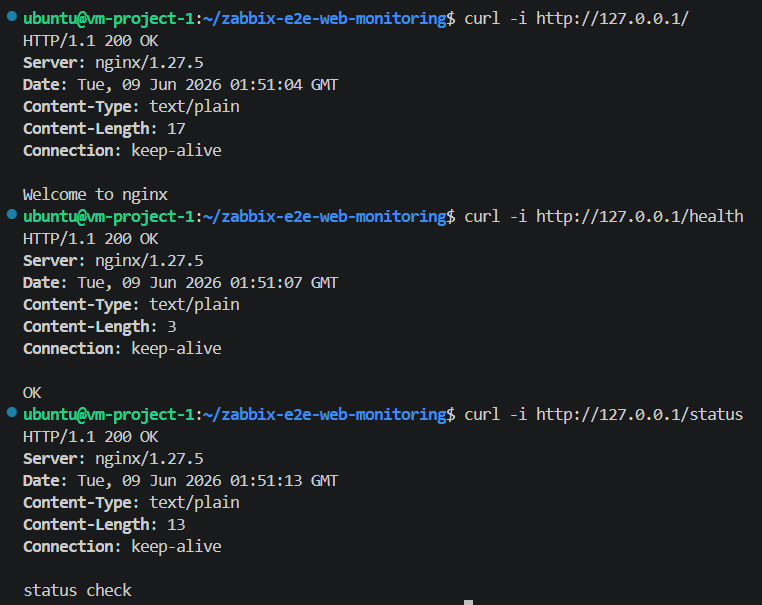

# Zabbix E2E Web Monitoring Project

Zabbix Web Scenario와 Browser Item을 활용하여 웹서비스의 가용성과 사용자 관점의 E2E 시나리오를 모니터링하는 프로젝트


## 1. 아키텍처


각 보라색 사각형은 Docker Compose로 구성한 컨테이너이다.

Zabbix Web UI는 관리자가 8080 포트로 접근하는 관리자 화면이다.
Web Scenario의 실제 HTTP 요청은 Zabbix Web UI가 아니라 `zabbix-server` 컨테이너가 수행한다.

nginx 샘플 앱은 Docker 내부 네트워크에서 다음 주소로 접근한다.

```text
http://nginx/
http://nginx/health
http://nginx/status
http://nginx/nginx_status
```


## 2. 시스템 구성

Docker Compose로 구성한 서비스는 다음과 같다.

| 서비스           | 컨테이너명             | 역할                               |
| ------------- | ----------------- | -------------------------------- |
| postgresql    | zabbix-postgresql | Zabbix 데이터 저장용 PostgreSQL 데이터베이스 |
| zabbix-server | zabbix-server     | Zabbix 모니터링 서버                   |
| zabbix-web    | zabbix-web        | Zabbix Web Frontend              |
| zabbix-agent2 | zabbix-agent2     | Zabbix Server에 호스트 상태 메트릭을 제공하는 모니터링 에이전트 |
| nginx-agent2  | nginx-agent2      | nginx 프로세스 및 내부 상태를 `system.run[]`으로 수집하는 전용 에이전트 |
| nginx         | nginx-sample      | Web Scenario 테스트용 샘플 웹서비스        |


## 3. 사전 요구사항

VM 환경에는 다음 소프트웨어가 필요하다.

* Ubuntu 24.04 LTS
* Docker Engine 26.x 이상
* Docker Compose v2.x 이상
* Zabbix Server	7.x LTS, Zabbix Web (Frontend) (동일 버전)
* PostgreSQL 15.x 이상
* nginx 1.24 이상
* Git 2.x 이상
* curl / wget 기본 포함


## 4. 네트워크 및 포트 정책

본 프로젝트는 Docker Compose에 서비스별 포트 사용 목적을 명시하고, 실제 외부 접근 제어는 Cloud VM의 Security Group에서 수행한다.
Security Group 인바운드 규칙은 허용 목록 방식으로 관리하며, 명시적으로 허용하지 않은 포트와 출발지는 암시적으로 거부된다.

| 컴포넌트             |        포트 | 용도                  | 노출 범위         | Security Group 정책       |
| ---------------- | --------: | ------------------- | ------------- | ----------------------- |
| Zabbix Web UI    |  8080/tcp | 관리자 Web UI 접속       | 외부 노출 필요      | 허용된 IP 또는 업무망에서만 허용    |
| Zabbix Server    | 10051/tcp | Zabbix 내부 서비스 포트    | Docker 내부 전용   | 외부 인바운드 허용 규칙 없음      |
| Zabbix Agent2    | 10050/tcp | Agent 통신 포트         | Docker 내부 전용   | 외부 인바운드 허용 규칙 없음      |
| nginx Agent2     | 10050/tcp | nginx 전용 Agent 통신 포트 | Docker 내부 전용   | 외부 인바운드 허용 규칙 없음      |
| nginx Sample App |    80/tcp | Web Scenario 테스트 대상 | Docker 내부 전용   | 외부 인바운드 허용 규칙 없음      |
| PostgreSQL       |  5432/tcp | Zabbix 데이터베이스       | Docker 내부 전용 | 외부 인바운드 허용 규칙 없음      |

Docker Compose에서 호스트에 publish되는 포트는 Zabbix Web UI의 `8080/tcp`뿐이다.
Zabbix Web Scenario에서는 외부 IP가 아니라 Docker 내부 서비스명인 `nginx`를 사용한다.
Zabbix Server는 Docker 내부 네트워크를 통해 `zabbix-agent2:10050`으로 Agent2에 접근한다.
nginx 전용 `nginx-agent2`는 `nginx-sample` 컨테이너의 PID namespace를 공유하여 nginx 프로세스 상태를 확인한다.


## 5. 설치 및 기동 방법

### 5.1 프로젝트 다운로드

GitHub 리포지토리를 VM에 내려받고 프로젝트 디렉터리로 이동한다.

```bash
git clone <REPOSITORY_URL>
cd zabbix-e2e-web-monitoring
```

### 5.2 환경 변수 설정

예시 환경 변수 파일을 복사하여 실제 Docker Compose 실행에 사용할 `.env` 파일을 생성한다.

```bash
cp .env.example .env
```

`.env` 파일에서 PostgreSQL 비밀번호와 Zabbix 서버명을 환경에 맞게 수정한다.

```env
POSTGRES_USER=zabbix
POSTGRES_PASSWORD=<CHANGE_ME>
POSTGRES_DB=zabbix_DB
ZBX_SERVER_NAME=Zabbix E2E Monitoring
ZBX_SERVER_HOST=zabbix-server
PHP_TZ=Asia/Seoul
```

### 5.3 서비스 기동

프로젝트 루트 디렉터리에서 다음 명령어를 실행한다.

```bash
docker compose up -d
```
- 정상 기동 예시


### 5.4 컨테이너 상태 확인

컨테이너 상태를 확인한다.

```bash
docker compose ps
```
- 정상 기동 예시


정상 기동 시 다음 컨테이너가 실행된다.

```text
nginx-sample
nginx-agent2
zabbix-agent2
zabbix-postgresql
zabbix-server
zabbix-web
```

### 5.5 nginx 샘플 앱 확인

VM 내부에서 nginx 샘플 앱의 주요 경로가 정상 응답하는지 확인한다.

```bash
curl -i http://127.0.0.1/
curl -i http://127.0.0.1/health
curl -i http://127.0.0.1/status
```
- 정상 기동 예시



nginx 설정 문법은 다음 명령어로 확인한다.

```bash
docker exec nginx-sample nginx -t
```

### 5.6 Zabbix Server에서 nginx 접근 확인

Web Scenario는 Zabbix Web UI가 아니라 `zabbix-server` 컨테이너에서 실행되므로, `zabbix-server` 컨테이너가 Docker 내부 네트워크로 nginx에 접근 가능한지 확인한다.

```bash
docker exec zabbix-server sh -c "wget -qO- http://nginx/"
docker exec zabbix-server sh -c "wget -qO- http://nginx/health"
docker exec zabbix-server sh -c "wget -qO- http://nginx/status"
```

### 5.7 서비스 중지

전체 서비스를 중지하려면 다음 명령어를 실행한다.

```bash
docker compose down
```

PostgreSQL 데이터 볼륨까지 삭제해야 하는 초기화 상황이 아니라면 `-v` 옵션은 사용하지 않는다.

```bash
# 주의: DB 볼륨 삭제
docker compose down -v
```


## 6. nginx 샘플 앱

### 6.1 Web Scenario 대상 엔드포인트

nginx 샘플 웹서비스는 Web Scenario 테스트 대상으로 사용된다.

| 경로        | 기대 응답                        | 검증 목적                     |
| --------- | ---------------------------- | ------------------------- |
| `/`       | HTTP 200, `Welcome to nginx` | 메인 페이지 응답 확인 |
| `/health` | HTTP 200, `OK`               | 상태 확인 엔드포인트 검증            |
| `/status` | HTTP 200, `status check`     | 상태 페이지 응답 및 응답시간 검증       |
| `/nginx_status` | nginx stub_status 응답 | Agent2 `system.run[]` 내부 지표 수집 |

### 6.2 zabbix-agent2 system.run 기반 nginx 내부 상태 수집

기존 Web Scenario는 URL 기준의 사용자 관점 가용성 검증에 사용한다.
추가로 `nginx-agent2`는 `system.run[]` item을 통해 스크립트를 실행하고 nginx 프로세스 및 내부 지표를 수집한다.

Zabbix UI에서 `nginx-sample` 호스트를 별도로 만들고 Agent Interface를 DNS `nginx-agent2`, Port `10050`으로 설정한다.
이후 다음 item key를 Zabbix agent 타입으로 등록한다.

```text
system.run[sh /var/lib/zabbix/user_scripts/nginx_process_count.sh]
system.run[sh /var/lib/zabbix/user_scripts/nginx_active_connections.sh]
system.run[sh /var/lib/zabbix/user_scripts/nginx_total_requests.sh]
```

각 item의 의미는 다음과 같다.

| item key | 수집 값 | 목적 |
| -------- | ------- | ---- |
| `nginx_process_count.sh` | nginx master/worker 프로세스 수 | URL이 아니라 프로세스 기준으로 nginx 동작 여부 확인 |
| `nginx_active_connections.sh` | 현재 active connection 수 | nginx 내부 연결 상태 확인 |
| `nginx_total_requests.sh` | 누적 request 수 | 요청 처리량 추세 확인 |

이 구성에서는 `system.run[]` 전체를 허용하지 않고, `docker-compose.yml`의 `ZBX_ALLOWKEY`로 필요한 스크립트 실행만 허용한다.

***보안상 주의할 점***은 다음과 같다.

* `system.run[]`은 Agent가 OS 명령을 실행하는 기능이므로 전체 허용하지 않고 필요한 명령만 `AllowKey`로 제한한다.
* `nginx-agent2`에는 Docker socket을 마운트하지 않는다. Docker socket을 열면 Agent가 다른 컨테이너나 호스트 Docker를 조작할 수 있어 권한 범위가 지나치게 커진다.
* `/nginx_status`는 내부 지표 엔드포인트이므로 외부에 공개하지 않고 Docker 내부 네트워크에서만 접근하도록 `allow`/`deny`를 설정한다.
* `nginx-agent2`는 `nginx-sample`의 PID namespace만 공유하여 프로세스 확인 범위를 nginx 컨테이너로 제한한다.


## 7. Zabbix Web UI 접속 및 초기 설정

Zabbix Web Frontend는 VM의 8080 포트로 접근한다.

```text
http://<VM_PUBLIC_IP>:8080
```

초기 로그인 정보는 다음과 같다.

```text
Username: Admin
Password: zabbix
```

최초 로그인 후 관리자 비밀번호를 변경하였다.

### 7.1 Zabbix Server Host 기본 설정

기본으로 생성되어 있는 `Zabbix server` Host는 Zabbix 서버 컨테이너와 Agent2 상태를 확인하는 기준 Host로 사용한다.

`Data collection` > `Hosts` > `Zabbix server`에서 Agent interface를 다음과 같이 설정한다.

| 항목 | 값 |
| --- | --- |
| DNS name | `zabbix-agent2` |
| Port | `10050` |
| Connect to | DNS |

### 7.2 nginx-sample Host 등록

nginx 내부 지표를 수집하기 위해 `nginx-sample` Host를 별도로 등록한다.

`Data collection` > `Hosts` > `Create host`에서 다음 값을 설정한다.

| 항목 | 값 |
| --- | --- |
| Host name | `nginx-sample` |
| Host group | `Linux servers` 또는 별도 생성한 그룹 |
| Interface type | Agent |
| DNS name | `nginx-agent2` |
| Port | `10050` |
| Connect to | DNS |

이 Host는 `nginx-agent2` 컨테이너를 통해 nginx 프로세스 및 `/nginx_status` 내부 지표를 수집한다.

### 7.3 nginx 내부 지표 Item 등록

`nginx-sample` Host의 `Items`에서 다음 Zabbix agent 타입 Item을 생성한다.

| Item name | Key | Type of information | Update interval |
| --- | --- | --- | --- |
| nginx process count | `system.run[sh /var/lib/zabbix/user_scripts/nginx_process_count.sh]` | Numeric unsigned | `1m` |
| nginx active connections | `system.run[sh /var/lib/zabbix/user_scripts/nginx_active_connections.sh]` | Numeric unsigned | `1m` |
| nginx total requests | `system.run[sh /var/lib/zabbix/user_scripts/nginx_total_requests.sh]` | Numeric unsigned | `1m` |

### 7.4 Web Scenario 등록

nginx Web Scenario는 `Zabbix server` Host 아래에 등록한다.

`Data collection` > `Hosts` > `Zabbix server` > `Web scenarios` > `Create web scenario`에서 다음 값을 설정한다.

| 항목 | 값 |
| --- | --- |
| Name | `nginx-web-availability` |
| Update interval | `1m` |
| Attempts | `1` |
| Agent | `Zabbix` |

Scenario Step은 다음과 같이 구성한다.

| Step | Name | URL | Required status codes | Required string |
| --- | --- | --- | --- | --- |
| 1 | `root` | `http://nginx/` | `200` | `Welcome to nginx` |
| 2 | `health` | `http://nginx/health` | `200` | `OK` |
| 3 | `status` | `http://nginx/status` | `200` | `status check` |

`/status` 응답시간 초과 테스트를 위해 `status` Step의 Timeout은 `10s` 또는 `15s` 정도로 설정한다. Timeout이 너무 짧으면 응답시간 초과가 아니라 Step 실패로 처리되어 `Nginx web scenario failed` Trigger가 발생할 수 있다.

Web Scenario는 Zabbix Web UI가 아니라 `zabbix-server` 컨테이너에서 실행되므로, URL은 외부 IP가 아닌 Docker 내부 서비스명 `nginx`를 사용한다.

### 7.5 Trigger 등록

Web Scenario 기반 Trigger는 `Zabbix server` Host에 등록한다.

| Trigger name | Severity | Expression | 목적 |
| --- | --- | --- | --- |
| `Nginx web scenario failed` | High | `last(/Zabbix server/web.test.fail[nginx-web-availability])>0` | nginx 중지, endpoint 접근 불가, timeout, 상태 코드 불일치, Required string 불일치 등 Web Scenario Step 실패 감지 |
| `Nginx endpoint response code is not 200` | High | `last(/Zabbix server/web.test.rspcode[nginx-web-availability,root])<>200 or last(/Zabbix server/web.test.rspcode[nginx-web-availability,health])<>200 or last(/Zabbix server/web.test.rspcode[nginx-web-availability,status])<>200` | `root`, `health`, `status` 중 하나라도 HTTP 200이 아닌 경우 감지 |
| `Nginx status response time is too high` | Warning | `last(/Zabbix server/web.test.time[nginx-web-availability,status,resp])>3` | `/status` 응답시간 3초 초과 감지 |

nginx 내부 지표 기반 Trigger는 `nginx-sample` Host에 등록한다.

| Trigger name | Severity | Expression | 목적 |
| --- | --- | --- | --- |
| `nginx active connections is high` | Warning | `last(/nginx-sample/system.run[sh /var/lib/zabbix/user_scripts/nginx_active_connections.sh])>50` | nginx active connection 과다 감지 |
| `nginx request counter reset detected` | Information | `change(/nginx-sample/system.run[sh /var/lib/zabbix/user_scripts/nginx_total_requests.sh])<0` | nginx 재시작 또는 request counter 초기화 감지 |

### 7.6 알람 발송 설정

알람은 Email Media type, 사용자 Media, Trigger Action 순서로 설정한다.

#### 7.6.1 Email Media type 설정

`Alerts` > `Media types` > `Email`에서 SMTP 정보를 설정한다.

| 항목 | 값 |
| --- | --- |
| SMTP server | 메일 서버 주소 |
| SMTP server port | `587` |
| Email | 발신자 주소 또는 표시 이름 |
| SMTP helo | 메일 도메인 |
| Connection security | `STARTTLS` |
| Authentication | `Username and password` |

설정 후 `Test` 버튼으로 메일 발송이 성공하는지 확인한다.

#### 7.6.2 사용자 Media 등록

`Users` > `Users` > `Admin` > `Media`에서 수신자를 등록한다.

| 항목 | 값 |
| --- | --- |
| Type | `Email` |
| Send to | 알림을 받을 이메일 주소 |
| When active | `1-7,00:00-24:00` |
| Use if severity | 전부 체크 |
| Enabled | 체크 |

#### 7.6.3 Trigger Action 등록

`Alerts` > `Actions` > `Trigger actions`에서 Web Scenario용 Action과 nginx 내부 지표용 Action을 분리하여 등록한다.

Web Scenario 장애 알림 Action:

| 항목 | 값 |
| --- | --- |
| Name | `Notify nginx web scenario problem` |
| Type of calculation | `And/Or` |
| Condition A | `Trigger equals Zabbix server: Nginx web scenario failed` |
| Condition B | `Trigger equals Zabbix server: Nginx status response time is too high` |
| Condition C | `Trigger equals Zabbix server: Nginx endpoint response code is not 200` |
| Enabled | checked |

nginx 내부 지표 장애 알림 Action:

| 항목 | 값 |
| --- | --- |
| Name | `Notify nginx internal trigger problems` |
| Type of calculation | `And/Or` |
| Condition A | `Trigger equals nginx-sample: nginx active connections is high` |
| Condition B | `Trigger equals nginx-sample: nginx request counter reset detected` |
| Enabled | checked |

각 Action의 `Operations`에는 장애 발생 메일을 등록한다.

```text
Send message to users: Admin
Send only to: Email
```

복구 알림을 받기 위해 `Recovery operations`에도 동일하게 메일 발송 Operation을 추가한다.

권장 메시지 제목은 다음과 같다.

```text
[PROBLEM] {EVENT.NAME}
[RESOLVED] {EVENT.NAME}
```

알람 설정 후 장애 테스트를 수행하고 `Reports` > `Action log`에서 메일 발송 결과가 `Sent`로 기록되는지 확인한다.


## 8. 장애 테스트 방법

장애 테스트는 Trigger가 `PROBLEM`으로 전환되는지, 복구 후 `RESOLVED`로 전환되는지, 그리고 Email Action이 정상 발송되는지 확인하는 절차이다.

장애 발생 후에는 `Monitoring` > `Problems`에서 Problem 상태를 확인하고, `Reports` > `Action log`에서 메일 발송 결과가 `Sent`로 기록되는지 확인한다.

### 8.1 Web Scenario 실패 테스트

nginx 컨테이너를 중지하여 Web Scenario의 모든 Step이 nginx에 접근하지 못하도록 만든다.

```bash
docker stop nginx-sample
```

기대 결과:

* `nginx-web-availability` Web Scenario가 실패한다.
* `Nginx web scenario failed` Trigger가 `PROBLEM` 상태로 전환된다.
* 장애 알림 메일이 수신된다.

<details>
<summary>장애 발생 스크린샷 보기</summary>


</details>

복구:

```bash
docker start nginx-sample
```

복구 후 기대 결과:

* Web Scenario가 다시 정상 실행된다.
* Trigger가 `RESOLVED` 상태로 전환된다.
* 복구 알림 메일이 수신된다.

<details>
<summary>복구 스크린샷 보기</summary>


</details>

### 8.2 `/status` 응답시간 초과 테스트

`/status` 응답이 3초를 초과하도록 nginx 설정을 임시로 변경한다. 테스트 전 원본 설정을 백업한다.

```bash
cp nginx/conf.d/default.conf nginx/conf.d/default.conf.bak
```

이 테스트는 `/status` Step이 실패하는 것이 아니라, HTTP 200 응답은 정상적으로 받되 응답시간만 3초를 초과하는지 확인하는 테스트이다. Web Scenario의 `status` Step Timeout은 `10s` 또는 `15s` 정도로 설정하고, nginx의 지연도 Timeout을 넘지 않도록 조정한다.

`nginx/conf.d/default.conf`의 `/status` location을 테스트용으로 변경한다.

```nginx
location /status {
    default_type text/plain;
    limit_rate 20;
    return 200 "status check slow response test data data data data data data data data data data\n";
}
```

변경한 설정을 nginx에 반영한다.

```bash
docker exec nginx-sample nginx -s reload
```

기대 결과:

* Web Scenario의 `status` Step 응답시간이 3초를 초과한다.
* `Nginx status response time is too high` Trigger가 `PROBLEM` 상태로 전환된다.
* `Nginx web scenario failed` Trigger는 발생하지 않는다.
* Warning 알림 메일이 수신된다.

<details>
<summary>장애 발생 스크린샷 보기</summary>


</details>

복구:

```bash
cp nginx/conf.d/default.conf.bak nginx/conf.d/default.conf
docker exec nginx-sample nginx -s reload
```

복구 후 기대 결과:

* `/status` 응답시간이 정상 범위로 돌아온다.
* Trigger가 `RESOLVED` 상태로 전환된다.
* 복구 알림 메일이 수신된다.

<details>
<summary>복구 스크린샷 보기</summary>


</details>

### 8.3 `/health` 응답 코드 비정상 테스트

`/health` 응답 코드가 `200`이 아니도록 nginx 설정을 임시로 변경한다. 테스트 전 원본 설정을 백업한다.

```bash
cp nginx/conf.d/default.conf nginx/conf.d/default.conf.bak
```

`nginx/conf.d/default.conf`의 `/health` location을 테스트용으로 변경한다.

```nginx
location /health {
    default_type text/plain;
    return 500 "health error\n";
}
```

변경한 설정을 nginx에 반영한다.

```bash
docker exec nginx-sample nginx -s reload
```

기대 결과:

* Web Scenario의 `health` Step에서 HTTP 응답 코드 `500`이 수집된다.
* `Nginx web scenario failed` Trigger가 `PROBLEM` 상태로 전환된다.
* `Nginx endpoint response code is not 200` Trigger가 `PROBLEM` 상태로 전환된다.
* 각 Trigger에 대한 High 알림 메일이 수신된다.

<details>
<summary>장애 발생 스크린샷 보기</summary>


</details>

복구:

```bash
cp nginx/conf.d/default.conf.bak nginx/conf.d/default.conf
docker exec nginx-sample nginx -s reload
```

복구 후 기대 결과:

* `/health` 응답 코드가 다시 `200`으로 돌아온다.
* Trigger가 `RESOLVED` 상태로 전환된다.
* 복구 알림 메일이 수신된다.

<details>
<summary>복구 스크린샷 보기</summary>


</details>

### 8.4 nginx active connections 증가 테스트

active connection 수가 50을 초과하도록 nginx에 임시 slow endpoint를 추가한다. 테스트 전 원본 설정을 백업한다.

```bash
cp nginx/conf.d/default.conf nginx/conf.d/default.conf.bak
```

`nginx/conf.d/default.conf`에 다음 location을 임시로 추가한다.

```nginx
location /slow {
    default_type text/plain;
    limit_rate 1;
    return 200 "slow connection test data data data data data data data data data data\n";
}
```

변경한 설정을 nginx에 반영한다.

```bash
docker exec nginx-sample nginx -s reload
```

Zabbix Server 컨테이너에서 `/slow`로 다수의 동시 요청을 발생시킨다.

```bash
docker exec zabbix-server sh -c 'for i in $(seq 1 60); do wget -qO- http://nginx/slow >/dev/null & done; sleep 90; wait'
```

기대 결과:

* `/nginx_status`의 active connections 값이 50을 초과한다.
* `nginx active connections is high` Trigger가 `PROBLEM` 상태로 전환된다.
* Warning 알림 메일이 수신된다.

<details>
<summary>장애 발생 스크린샷 보기</summary>


</details>

복구:

`/slow` location을 제거하거나 백업한 nginx 설정으로 되돌린 뒤 reload한다.

```bash
cp nginx/conf.d/default.conf.bak nginx/conf.d/default.conf
docker exec nginx-sample nginx -s reload
```

복구 후 기대 결과:

* active connections 값이 정상 범위로 감소한다.
* Trigger가 `RESOLVED` 상태로 전환된다.
* 복구 알림 메일이 수신된다.

<details>
<summary>복구 스크린샷 보기</summary>


</details>

### 8.5 nginx request counter reset 테스트

먼저 nginx request counter가 증가하도록 여러 번 요청을 발생시킨다.

```bash
docker exec zabbix-server sh -c 'for i in $(seq 1 30); do wget -qO- http://nginx/status >/dev/null; done'
```

`Monitoring` > `Latest data`에서 `nginx total requests` 값이 증가한 것을 확인한 뒤 nginx 컨테이너를 재시작한다.

```bash
docker restart nginx-sample
```

기대 결과:

* nginx `stub_status`의 누적 request counter가 초기화된다.
* 이전 수집값보다 최신 수집값이 작아진다.
* `nginx request counter reset detected` Trigger가 `PROBLEM` 상태로 전환된다.
* Information 알림 메일이 수신된다.

<details>
<summary>장애 발생 스크린샷 보기</summary>


</details>

복구:

nginx 컨테이너가 정상 실행 중인지 확인하고, request counter가 다시 증가하는지 확인한다.

```bash
docker compose ps nginx
docker exec zabbix-server sh -c 'wget -qO- http://nginx/status >/dev/null'
```

복구 후 기대 결과:

* nginx가 정상 실행된다.
* Trigger가 `RESOLVED` 상태로 전환된다.
* 복구 알림 메일이 수신된다.

<details>
<summary>복구 스크린샷 보기</summary>


</details>


## 9. 트러블슈팅
### 9.1 Zabbix Agent2 Not Available

* 증상: Zabbix UI에서 `Zabbix agent is not available` 문제 발생
* 원인: Zabbix Host의 Agent Interface가 Docker 내부 Agent2 컨테이너 주소와 일치하지 않음
* 해결:

  * `docker-compose.yml`에서 `ZBX_HOSTNAME`을 `Zabbix server`로 설정
  * Zabbix UI에서 `Zabbix server` Host의 Agent Interface를 DNS `zabbix-agent2`, Port `10050`으로 수정

### 9.2 Action Log: No media defined for user

* 증상:

  * `Monitoring` > `Problems`에는 Trigger가 정상적으로 `PROBLEM` 상태로 표시됨
  * `Reports` > `Action log`에는 메일 발송 실패 기록이 남음
  * Info에 다음 오류가 표시됨

```text
No media defined for user
```

* 원인:

  * Email Media type은 설정되어 있지만, 실제 수신자인 `Admin` 사용자에게 Media가 등록되어 있지 않음
  * Trigger Action은 사용자에게 메시지를 보내려고 했지만, 해당 사용자의 수신 이메일 정보를 찾지 못함

* 해결:

  * `Users` > `Users` > `Admin` > `Media`에서 Email Media를 추가
  * 수신 이메일 주소, 활성 시간, Severity 조건을 설정
  * Action을 저장한 뒤 기존 Problem이 아니라 새로운 Problem 이벤트를 발생시켜 다시 테스트
