# Zabbix E2E Web Monitoring Project

Zabbix Web Scenario와 Browser Item을 활용하여 웹서비스의 가용성과 사용자 관점의 E2E 시나리오를 모니터링하는 프로젝트


<details>
<summary><strong>1. 아키텍처</strong></summary>

## 1. 아키텍처

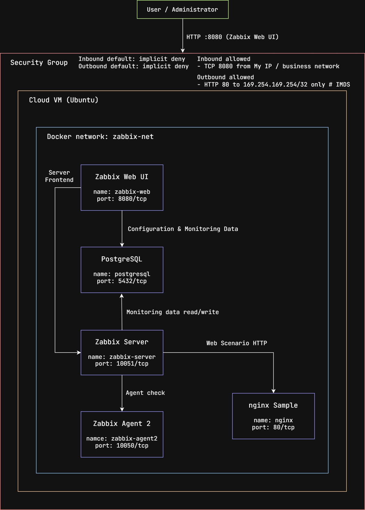

Docker Compose로 구성한 서비스는 다음과 같다.

| 서비스 | 컨테이너명 | 역할 |
| --- | --- | --- |
| postgresql | zabbix-postgresql | Zabbix 데이터 저장용 PostgreSQL 데이터베이스 |
| zabbix-server | zabbix-server | Zabbix 모니터링 서버 |
| zabbix-web | zabbix-web | Zabbix Web Frontend |
| zabbix-agent2 | zabbix-agent2 | Zabbix Server에 호스트 상태 메트릭을 제공하는 모니터링 에이전트 |
| nginx-agent2 | nginx-agent2 | nginx 프로세스 및 내부 상태를 UserParameter로 수집하는 전용 에이전트 |
| nginx | nginx-sample | Web Scenario 테스트용 샘플 웹서비스 |
| selenium-chrome | selenium-chrome | Browser Item 실행을 위한 Selenium WebDriver/Chrome 컨테이너 |


</details>


<details>
<summary><strong>2. 사전 요구사항</strong></summary>

## 2. 사전 요구사항

VM 환경에는 다음 소프트웨어가 필요하다.

* Ubuntu 24.04 LTS
* Docker Engine 26.x 이상
* Docker Compose v2.x 이상
* Git 2.x 이상
* Python 3.x (Dashboard 생성 스크립트 실행용)
* curl 또는 wget (접속 확인 및 문제 진단용)

Zabbix, PostgreSQL, nginx, Selenium의 컨테이너 이미지 버전은 다음과 같다.

| 구성요소 | 이미지 버전 |
| --- | --- |
| Zabbix Server / Web / Agent 2 | `7.0.27` |
| PostgreSQL | `16.14-alpine` |
| nginx | `1.27.5-alpine` |
| Selenium Chrome | `4.21.0` |


</details>

<details>
<summary><strong>3. 네트워크 및 포트 정책</strong></summary>

## 3. 네트워크 및 포트 정책

### 3.1 Security Group 정책:

| 방향 | 대상 | 설명 |
| --- | --- | --- |
| Inbound | `22/tcp`, `8080/tcp` | 관리자 IP 또는 업무망에서만 허용 |
| Outbound | All traffic | 외부 Browser Item, SMTP, Docker/Git/패키지 다운로드 |

Inbound의 경우, 명시적으로 허용하지 않은 포트와 출발지는 암시적으로 거부된다. <br>
Outbound의 경우, 개발/테스트 환경에서는 편의성을 위해 전체 허용해도 되지만 실제 운영 환경에서는 외부 서비스 접속 대상이 확정된 뒤 HTTPS, SMTP, IMDS 등 필요한 목적지와 포트만 허용하도록 축소해야 한다.

### 3.2 Docker Compose 내 Service 별 정책

| Service          | 포트      | 용도                  | 노출 범위         | Security Group 정책       |
| ---------------- | --------- | ------------------- | ------------- | ----------------------- |
| Zabbix Web UI    |  8080/tcp | 관리자 Web UI 접속       | 외부 노출 필요      | 허용된 IP or 업무망에서만 허용    |
| Zabbix Server    | 10051/tcp | Zabbix 내부 서비스 포트    | Docker 내부 전용   | 외부 인바운드 허용 X      |
| Zabbix Agent2    | 10050/tcp | Agent 통신 포트         | Docker 내부 전용   | 외부 인바운드 허용 X      |
| nginx Agent2     | 10050/tcp | nginx 전용 Agent 통신 포트 | Docker 내부 전용   | 외부 인바운드 허용 X      |
| nginx Sample App |    80/tcp | Web Scenario 테스트 대상 | Docker 내부 전용   | 외부 인바운드 허용 X      |
| PostgreSQL       |  5432/tcp | Zabbix 데이터베이스       | Docker 내부 전용 | 외부 인바운드 허용 X     |

Docker Compose에서 호스트에 publish되는 포트는 Zabbix Web UI의 `8080/tcp`뿐이다.<br>
이 외의 서비스는 Docker 네트워크 내부에서만 통신하므로 외부에서 직접 접근할 필요가 없다.

</details>

<details>
<summary><strong>4. 설치 및 기동 방법</strong></summary>

## 4. 설치 및 기동 방법

### 4.1 프로젝트 다운로드

GitHub 리포지토리를 VM에 내려받고 프로젝트 디렉터리로 이동한다.

```bash
git clone <REPOSITORY_URL>
cd zabbix-e2e-web-monitoring
```

### 4.2 환경 변수 설정

예시 환경 변수 파일을 복사하여 실제 Docker Compose 실행에 사용할 `.env` 파일을 생성한다.

```bash
cp .env.example .env
```

이후 `.env` 파일에서 *POSTGRES_PASSWORD*와 *ZBX_SERVER_NAME*을 환경에 맞게 수정한다.

```env
POSTGRES_USER=zabbix
POSTGRES_PASSWORD=<CHANGE_ME>
POSTGRES_DB=zabbix_DB
ZBX_SERVER_NAME=Zabbix E2E Monitoring
ZBX_SERVER_HOST=zabbix-server
PHP_TZ=Asia/Seoul
NGINX_BASIC_AUTH_HEADER=<BASE64_USER_PASSWORD>
```

nginx 샘플 앱은 *HTTP Basic Auth*를 사용하며, 실제 인증 파일은 로컬에서 생성한다.<br>
다음 예시와 같이 `zabbix-monitor` 사용자를 생성한 후 비밀번호를 base64로 인코딩한 값을 `.env`의 `NGINX_BASIC_AUTH_HEADER`에 입력한다.<br>
이때, `nginx/.htpasswd`는 인증 정보 파일이므로 Git에 커밋하지 않는다.

```bash
sudo apt-get update
sudo apt-get install -y apache2-utils
htpasswd -nbB zabbix-monitor '<NGINX_BASIC_PASSWORD>' > nginx/.htpasswd
printf 'zabbix-monitor:<NGINX_BASIC_PASSWORD>' | base64 -w 0
```

### 4.3 서비스 기동

프로젝트 루트 디렉터리에서 다음 명령어를 실행한다.

```bash
docker compose up -d
```
- 정상 기동 예시

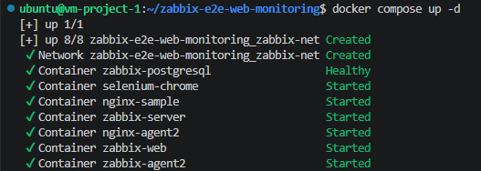

### 4.4 컨테이너 상태 확인

컨테이너 상태를 확인한다.

```bash
docker compose ps
```
- 정상 기동 예시

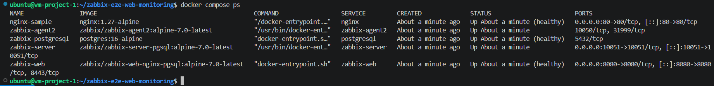

### 4.5 Zabbix Server에서 nginx 접근 확인

`zabbix-server` 컨테이너가 Docker 내부 네트워크로 nginx에 접근 가능한지 확인한다.<br>
Basic Auth가 적용되어 있으므로 `<BASE64_USER_PASSWORD>`는 `.env`의 `NGINX_BASIC_AUTH_HEADER` 값으로 치환한다.

```bash
docker exec zabbix-server sh -c "wget --header 'Authorization: Basic <BASE64_USER_PASSWORD>' -qO- http://nginx/"
docker exec zabbix-server sh -c "wget --header 'Authorization: Basic <BASE64_USER_PASSWORD>' -qO- http://nginx/health"
docker exec zabbix-server sh -c "wget --header 'Authorization: Basic <BASE64_USER_PASSWORD>' -qO- http://nginx/status"
```

### 4.6 최초 기동 후 Zabbix UI 초기 구성

새 PC 또는 새 VM에서 처음 Docker 컨테이너 실행 시, Zabbix DB에는 프로젝트 설정이 들어 있지 않다. <br>
따라서 Zabbix Web UI에 접속한 뒤 Host export XML import, Media type, 사용자 Media, Host macro, Trigger Action을 추가로 설정한다.

Zabbix Web UI 접속 정보는 다음과 같다.

```text
URL: http://<VM_PUBLIC_IP>:8080
Username: Admin
Password: zabbix
```

초기 구성 순서는 다음과 같이 진행한다. 상세 정보는 6. Zabbix Web UI 접속 및 초기 설정 섹션에 설명되어 있다.

| 순서 | 작업 | 위치 | 참고 |
| --- | --- | --- | --- |
| 1 | Zabbix Host export XML import | `Data collection` > `Hosts` > `Import` | 아래 XML 3개 파일 import |
| 2 | Host Agent interface 확인 | `Data collection` > `Hosts` | `Zabbix server`는 `zabbix-agent2`, `nginx-sample`은 `nginx-agent2` DNS 사용 |
| 3 | nginx Web Scenario Basic Auth 비밀번호 입력 | `Zabbix server` > `Web scenarios` > `nginx-web-availability` | XML의 `<NGINX_BASIC_PASSWORD>` placeholder를 실제 nginx Basic Auth 비밀번호로 변경 |
| 4 | Midibus Host macro 실제 값 입력 | `midibus-web` > `Macros` | 계정, 비밀번호, 허용 IP 등 민감 값은 XML에서 placeholder로 마스킹되어 있음 |
| 5 | Email Media type 설정 | `Alerts` > `Media types` > `Email` | SMTP 서버, 포트, 인증 정보 설정 후 `Test` 수행 |
| 6 | Admin 사용자 Media 등록 | `Users` > `Users` > `Admin` > `Media` | Type `Email`, 수신 주소, 활성 시간, Severity 설정 |
| 7 | Trigger Action 등록 | `Alerts` > `Actions` > `Trigger actions` | Web Scenario, nginx 내부 지표, Browser Item용 Action 등록 |
| 8 | Dashboard 생성 | Zabbix API | `zabbix/api/create_dashboard.py` 실행 |
| 9 | 수집 및 알림 동작 확인 | `Monitoring` / `Reports` | Latest data, Problems, Action log, 메일 수신 확인 |

<br>

Import 대상 XML 파일은 다음과 같다.

| XML 파일 | 포함 내용 |
| --- | --- |
| `zabbix/export/zbx_export_hosts_Zabbix-server.xml` | `Zabbix server` Host, nginx Web Scenario, Web Scenario Trigger. Basic Auth 비밀번호는 `<NGINX_BASIC_PASSWORD>`로 마스킹됨 |
| `zabbix/export/zbx_export_hosts_nginx-sample.xml` | `nginx-sample` Host, nginx 내부 지표 Item, nginx 내부 지표 Trigger |
| `zabbix/export/zbx_export_hosts_midibus-web.xml` | `midibus-web` Host, Browser Item, Dependent Item, Browser Item Trigger |

<br>

`midibus-web` Host에서 실제 환경에 맞게 다시 설정해야 하는 주요 macro는 다음과 같다.

| Macro | 용도 |
| --- | --- |
| `{$MIDIBUS_URL}` | Midibus 로그인 URL |
| `{$MIDIBUS_USER}` | 로그인 사용자 ID |
| `{$MIDIBUS_PASSWORD}` | 로그인 비밀번호 |
| `{$MIDIBUS_TEST_PREFIX}` | 테스트 데이터 접두어 |
| `{$MIDIBUS_TEST_VIDEO_PATH}` | Selenium 컨테이너 내부 테스트 영상 경로 |
| `{$MIDIBUS_ALLOWED_IP}` | 보안 재생키 허용 IP |

이때, `{$MIDIBUS_TEST_VIDEO_PATH}`는 Selenium 컨테이너 내부 경로를 사용한다.

```text
/opt/zabbix/browser-files/zbx-bi-test-video.mp4
```

<br>

Trigger Action은 Host export XML에 포함되지 않으므로 새 환경에서는 직접 등록해야 한다.<br>
본 프로젝트에서 사용한 Action은 다음 4개이다.

```text
Midibus Browser Execution Failure
Midibus Feature Validation Failure
Notify nginx internal trigger problems
Notify nginx web scenario problem
```

<br>

각 Action의 조건, Operation, Recovery operation 설정값은 6.6 알람 발송 설정과 9.4 Browser Item Email 알림을 기준으로 등록한다.

Dashboard는 Zabbix API로 생성한다. 기본 접속 정보(`Admin` / `zabbix`)를 그대로 사용하는 경우 다음 명령어로 생성할 수 있다.
생성되는 Dashboard는 `Overview`, `Browser Items`, `Web Scenario`, `nginx System`의 4개 탭으로 구성되며 전체 현황과 대상별 상태, 문제, 지표 및 알림 이력을 제공한다.

```bash
python3 zabbix/api/create_dashboard.py
```

만약 Zabbix 관리자 비밀번호를 변경했다면, 아래와 같이 환경 변수로 API 접속 정보를 지정한다.
Dashboard 생성 스크립트를 Zabbix가 실행 중인 VM 내부에서 실행한다면 API URL은 `127.0.0.1`을 사용한다.
외부 PC에서 실행할 때만 `<VM_PUBLIC_IP>`를 사용한다.

```bash
ZABBIX_URL="http://127.0.0.1:8080/api_jsonrpc.php" \
ZABBIX_USER="Admin" \
ZABBIX_PASSWORD="<ZABBIX_ADMIN_PASSWORD>" \
python3 zabbix/api/create_dashboard.py
```

이때, Zabbix API 접속 정보는 민감 정보이므로 `export`로 세션에 계속 남기지 않고 위처럼 일회성 환경 변수로 실행한다.
이미 `export`로 설정했다면 Dashboard 적용 후 다음 명령어로 현재 셸에서 삭제한다.

```bash
unset ZABBIX_URL ZABBIX_USER ZABBIX_PASSWORD
```

만약 동일한 이름의 Dashboard가 이미 있으면 중복 생성되지 않는다. 이 경우에는 기존 Dashboard를 삭제하고 다시 생성하기 위해 `--replace` 옵션을 사용한다.

```bash
python3 zabbix/api/create_dashboard.py --replace
```

초기 구성 후에는 Dashboard, Web Scenario 최신 데이터, Browser Item 최신 데이터, `Reports` > `Action log`의 발송 결과를 확인한다.

### 4.7 서비스 중지

전체 서비스를 중지하려면 다음 명령어를 실행한다.

```bash
docker compose down
```

PostgreSQL 데이터 볼륨까지 삭제해야 하는 초기화 상황이 아니라면 `-v` 옵션은 사용하지 않는다.

```bash
# 주의: DB 볼륨 삭제
docker compose down -v
```


</details>

<details>
<summary><strong>5. nginx Sample App</strong></summary>

## 5. nginx Sample App

### 5.1 nginx Endpoint

nginx 샘플 웹서비스는 Web Scenario 가용성 점검과 nginx 내부 지표 및 부하 테스트를 위한 Endpoint를 제공한다.

| 경로 | 기대 응답 | 용도 |
| --- | --- | --- |
| `/` | HTTP 200, `Welcome to nginx` | Web Scenario Endpoint |
| `/health` | HTTP 200, `OK` | Web Scenario Endpoint |
| `/status` | HTTP 200, `status check` | Web Scenario Endpoint |
| `/load-slow` | HTTP 200, 저속 응답 | active connection 부하 테스트 시 연결을 일정 시간 유지 |
| `/nginx_status` | nginx `stub_status` | Agent 2를 통한 nginx 프로세스 및 내부 상태 지표 수집 |

- `/load-slow`는 `scripts/nginx_load_test.sh active` 명령에서만 사용하는 부하 테스트용 Endpoint이며, 정기 Web Scenario Step에는 포함하지 않는다.

- `/nginx_status`는 Docker 내부 네트워크와 localhost에서만 접근하도록 제한되어 있으며 외부 공개 대상이 아니다.

### 5.2 zabbix-agent2 UserParameter 기반 nginx 내부 상태 수집

`nginx-agent2`는 UserParameter item을 통해 스크립트를 실행하고 nginx 프로세스 및 내부 지표를 수집한다.
UserParameter 설정은 `zabbix/agent2/nginx-userparameter.conf`에 정의되어 있으며, Docker Compose에서 Agent2 설정 디렉터리로 읽기 전용 마운트된다.

Zabbix UI에서 `nginx-sample` 호스트를 별도로 만들고 Agent Interface를 DNS `nginx-agent2`, Port `10050`으로 설정한다.
이후 다음 item key를 Zabbix agent 타입으로 등록한다.

```text
nginx.process_count
nginx.active_connections
nginx.total_requests
```

예시 스크린샷

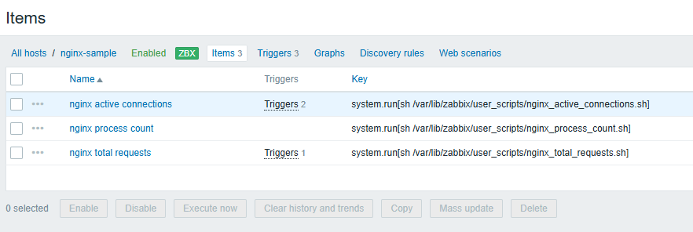


<br>
참고: 스크립트의 원본들은 리포지토리의 `scripts/agent2/` 디렉터리에 있으며, Docker Compose에서 `/var/lib/zabbix/user_scripts`로 읽기 전용 마운트된다.

각 item의 의미는 다음과 같다.

| item key | 수집 값 | 목적 |
| -------- | ------- | ---- |
| `nginx.process_count` | nginx master/worker 프로세스 수 | URL이 아니라 프로세스 기준으로 nginx 동작 여부 확인 |
| `nginx.active_connections` | 현재 active connection 수 | nginx 내부 연결 상태 확인 |
| `nginx.total_requests` | 누적 request 수 | 요청 처리량 추세 확인 |

***보안상 주의할 점***은 다음과 같다.

* UserParameter 설정 파일에는 필요한 nginx 지표 수집 명령만 등록한다.
* `nginx-agent2`에는 Docker socket을 마운트하지 않는다. Docker socket을 열면 Agent가 다른 컨테이너나 호스트 Docker를 조작할 수 있어 권한 범위가 지나치게 커진다.
* `/nginx_status`는 내부 지표 엔드포인트이므로 외부에 공개하지 않고 Docker 내부 네트워크에서만 접근하도록 `allow`/`deny`를 설정한다.
* `nginx-agent2`는 `nginx-sample`의 PID namespace만 공유하여 프로세스 확인 범위를 nginx 컨테이너로 제한한다.

</details>

<details>
<summary><strong>6. Zabbix Web UI 접속 및 초기 설정</strong></summary>

## 6. Zabbix Web UI 접속 및 초기 설정

### 6.1 Zabbix Server Host 기본 설정

기본으로 생성되어 있는 `Zabbix server` Host는 Zabbix 서버 컨테이너와 Agent2 상태를 확인하는 기준 Host로 사용한다.

`Data collection` > `Hosts` > `Zabbix server`에서 Agent interface를 다음과 같이 설정한다.

| 항목 | 값 |
| --- | --- |
| DNS name | `zabbix-agent2` |
| Port | `10050` |
| Connect to | DNS |

### 6.2 nginx-sample Host 등록

nginx 내부 지표를 수집하기 위해 `nginx-sample` Host를 별도로 등록한다.

`Data collection` > `Hosts` > `Create host`에서 다음 값을 설정한다.

| 항목 | 값 |
| --- | --- |
| Host name | `nginx-sample` |
| Host group | `Linux servers` 또는 별도 생성한 그룹 |
| Interface type | Agent |
| DNS name | `nginx-agent2` |
| Port | `10050` |
| Connect to | DNS |

이 Host는 `nginx-agent2` 컨테이너를 통해 nginx 프로세스 및 `/nginx_status` 내부 지표를 수집한다.

### 6.3 nginx 내부 지표 Item 등록

`nginx-sample` Host의 `Items`에서 다음 Zabbix agent 타입 Item을 생성한다.

| Item name | Key | Type of information | Update interval |
| --- | --- | --- | --- |
| nginx process count | `nginx.process_count` | Numeric unsigned | `30s` |
| nginx active connections | `nginx.active_connections` | Numeric unsigned | `30s` |
| nginx total requests | `nginx.total_requests` | Numeric unsigned | `30s` |

### 6.4 Web Scenario 등록

nginx Web Scenario는 `Zabbix server` Host 아래에 등록한다.

`Data collection` > `Hosts` > `Zabbix server` > `Web scenarios` > `Create web scenario`에서 다음 값을 설정한다.

| 항목 | 값 |
| --- | --- |
| Name | `nginx-web-availability` |
| Update interval | `1m` |
| Attempts | `1` |
| Agent | `Zabbix` |
| Headers | `User-Agent: Zabbix-Web-Monitor/1.0` |

Scenario Step은 다음과 같이 구성한다.

| Step | Name | URL | Required status codes | Required string |
| --- | --- | --- | --- | --- |
| 1 | `root` | `http://nginx/` | `200` | `Welcome to nginx` |
| 2 | `health` | `http://nginx/health` | `200` | `OK` |
| 3 | `status` | `http://nginx/status` | `200` | `status check` |

`/status` 응답시간 초과 테스트를 위해 `status` Step의 Timeout은 `10s` 또는 `15s` 정도로 설정한다. Timeout이 너무 짧으면 응답시간 초과가 아니라 Step 실패로 처리되어 `Nginx web scenario failed` Trigger가 발생할 수 있다.

Web Scenario는 Zabbix Web UI가 아니라 `zabbix-server` 컨테이너에서 실행되므로, URL은 외부 IP가 아닌 Docker 내부 서비스명 `nginx`를 사용한다.

### 6.5 Trigger 등록

Web Scenario 기반 Trigger는 `Zabbix server` Host에 등록한다.

| Trigger name | Severity | Expression | 목적 |
| --- | --- | --- | --- |
| `Nginx web scenario failed` | High | `last(/Zabbix server/web.test.fail[nginx-web-availability])>0` | nginx 중지, endpoint 접근 불가, timeout, 상태 코드 불일치, Required string 불일치 등 Web Scenario Step 실패 감지 |
| `Nginx endpoint response code is not 200` | High | `last(/Zabbix server/web.test.rspcode[nginx-web-availability,root])<>200 or last(/Zabbix server/web.test.rspcode[nginx-web-availability,health])<>200 or last(/Zabbix server/web.test.rspcode[nginx-web-availability,status])<>200` | `root`, `health`, `status` 중 하나라도 HTTP 200이 아닌 경우 감지 |
| `Nginx status response time is too high` | Warning | `last(/Zabbix server/web.test.time[nginx-web-availability,status,resp])>3` | `/status` 응답시간 3초 초과 감지 |

nginx 내부 지표 기반 Trigger는 `nginx-sample` Host에 등록한다.

| Trigger name | Severity | Expression | 목적 |
| --- | --- | --- | --- |
| `nginx active connections is critically high` | High | `last(/nginx-sample/nginx.active_connections)>100` | 순간적인 active connection 급증 감지 |
| `nginx active connections is high` | Warning | `min(/nginx-sample/nginx.active_connections,1m)>50` | 1분 이상 지속되는 active connection 과다 감지 |
| `nginx request counter reset detected` | Information | `change(/nginx-sample/nginx.total_requests)<0` | nginx 재시작 또는 request counter 초기화 감지 |

### 6.6 알람 발송 설정

알람은 Email Media type, 사용자 Media, Trigger Action 순서로 설정한다.

#### 6.6.1 Email Media type 설정

`Alerts` > `Media types` > `Email`에서 SMTP 정보를 설정한다.

| 항목 | 값 |
| --- | --- |
| SMTP server | 메일 서버 주소 |
| SMTP server port | `587` |
| Email | 발신자 주소 또는 표시 이름 |
| SMTP helo | 메일 도메인 |
| Connection security | `STARTTLS` |
| Authentication | `Username and password` |

설정 후 `Test` 버튼으로 메일 발송이 성공하는지 확인한다.

#### 6.6.2 사용자 Media 등록

`Users` > `Users` > `Admin` > `Media`에서 수신자를 등록한다.

| 항목 | 값 |
| --- | --- |
| Type | `Email` |
| Send to | 알림을 받을 이메일 주소 |
| When active | `1-7,00:00-24:00` |
| Use if severity | 전부 체크 |
| Enabled | 체크 |

#### 6.6.3 Trigger Action 등록

`Alerts` > `Actions` > `Trigger actions`에서 Web Scenario용 Action과 nginx 내부 지표용 Action을 분리하여 등록한다.

Web Scenario 장애 알림 Action:

| 항목 | 값 |
| --- | --- |
| Name | `Notify nginx web scenario problem` |
| Type of calculation | `And/Or` |
| Condition A | `Trigger equals Zabbix server: Nginx web scenario failed` |
| Condition B | `Trigger equals Zabbix server: Nginx status response time is too high` |
| Condition C | `Trigger equals Zabbix server: Nginx endpoint response code is not 200` |
| Enabled | checked |

nginx 내부 지표 장애 알림 Action:

| 항목 | 값 |
| --- | --- |
| Name | `Notify nginx internal trigger problems` |
| Type of calculation | `And/Or` |
| Condition A | `Trigger equals nginx-sample: nginx active connections is critically high` |
| Condition B | `Trigger equals nginx-sample: nginx active connections is high` |
| Condition C | `Trigger equals nginx-sample: nginx request counter reset detected` |
| Enabled | checked |

각 Action의 `Operations`에는 장애 발생 메일을 등록한다.

```text
Send message to users: Admin
Send only to: Email
```

복구 알림을 받기 위해 `Recovery operations`에도 동일하게 메일 발송 Operation을 추가한다.

권장 메시지 제목은 다음과 같다.

```text
[PROBLEM] {EVENT.NAME}
[RESOLVED] {EVENT.NAME}
```

<details>
<summary><strong>Trigger Action 설정 스크린샷</strong></summary>

<p><sub>Trigger actions 창 예시</sub></p>

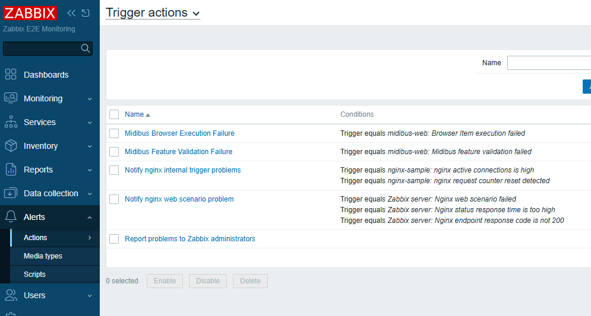

<p><sub>Trigger actions - Action 예시</sub></p>

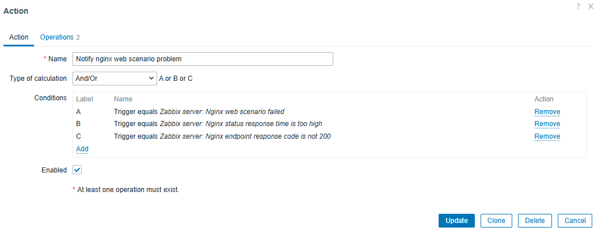

<p><sub>Trigger actions - Operations 예시</sub></p>

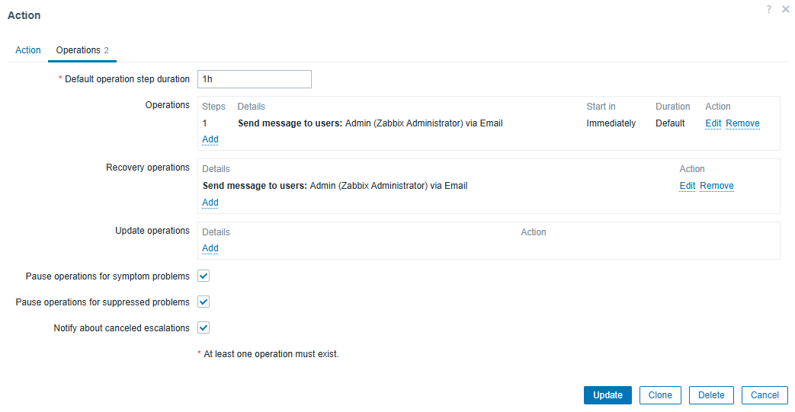

<p><sub>Trigger actions - Operations - Edit - Operation details 예시</sub></p>

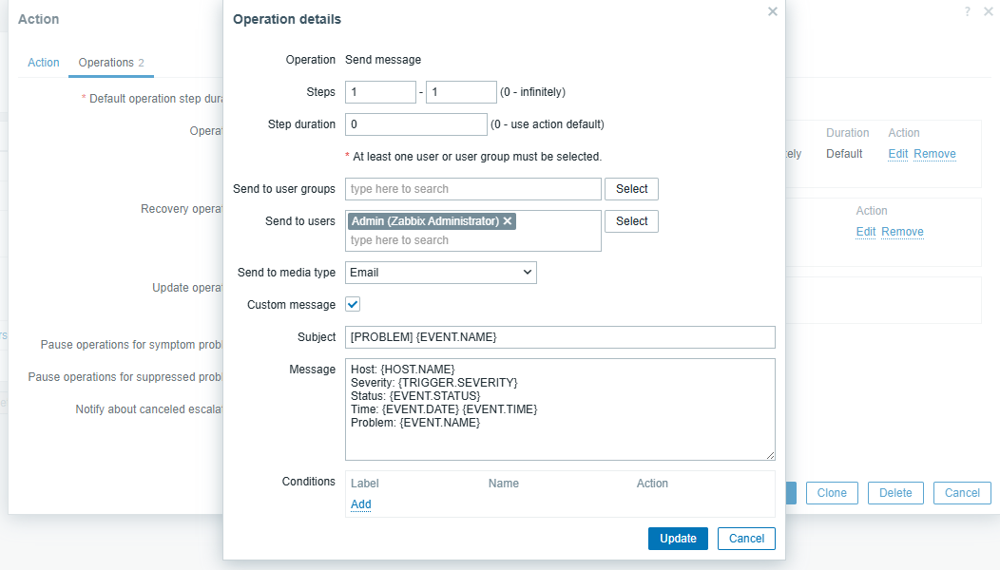

</details>

알람 설정 후 장애 테스트를 수행하고 `Reports` > `Action log`에서 메일 발송 결과가 `Sent`로 기록되는지 확인한다.


</details>

<details>
<summary><strong>7. Web Scenario 장애 테스트 방법</strong></summary>

## 7. Web Scenario 장애 테스트 방법

Web Scenario 장애 테스트는 Trigger가 `PROBLEM`으로 전환되는지, 복구 후 `RESOLVED`로 전환되는지, 그리고 Email Action이 정상 발송되는지 확인하는 절차이다.

장애 발생 후에는 `Monitoring` > `Problems`에서 Problem 상태를 확인하고, `Reports` > `Action log`에서 메일 발송 결과가 `Sent`로 기록되는지 확인한다.

### 7.1 Web Scenario 실패 테스트

nginx 컨테이너를 중지하여 Web Scenario의 모든 Step이 nginx에 접근하지 못하도록 만든다.

```bash
docker stop nginx-sample
```

기대 결과:

* `nginx-web-availability` Web Scenario가 실패한다.
* `Nginx web scenario failed` Trigger가 `PROBLEM` 상태로 전환된다.
* 장애 알림 메일이 수신된다.

<details>
<summary><strong>장애 발생 스크린샷 보기</strong></summary>


<p><sub>nginx 컨테이너 중지 명령 실행</sub></p>

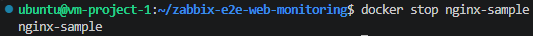


<p><sub>Web Scenario 실패 Trigger PROBLEM 전환</sub></p>

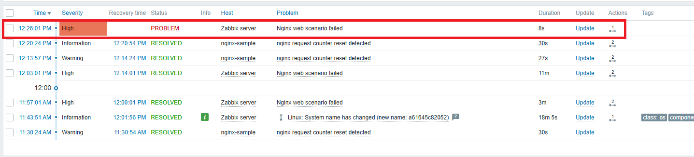


<p><sub>Web Scenario 실패 알림 메일 수신</sub></p>

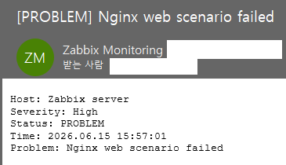

</details>

복구:

```bash
docker start nginx-sample
```

복구 후 기대 결과:

* Web Scenario가 다시 정상 실행된다.
* Trigger가 `RESOLVED` 상태로 전환된다.
* 복구 알림 메일이 수신된다.

<details>
<summary><strong>복구 스크린샷 보기</strong></summary>

<p><sub>nginx 컨테이너 재기동 명령 실행</sub></p>

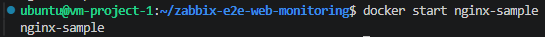


<p><sub>Web Scenario 실패 Trigger RESOLVED 전환</sub></p>

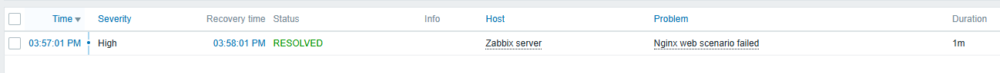


<p><sub>Web Scenario 복구 알림 메일 수신</sub></p>

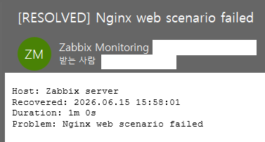

</details>

### 7.2 `/status` 응답시간 초과 테스트

이 테스트는 HTTP 200 응답은 정상적으로 받되 응답시간만 3초를 초과하는지 확인하는 테스트이다. Web Scenario의 `status` Step Timeout은 `10s` 또는 `15s` 정도로 설정하고, nginx의 지연도 Timeout을 넘지 않도록 조정한다.


`/status` 응답이 3초를 초과하도록 nginx 설정을 임시로 변경한다. 테스트 전 원본 설정을 백업한다.

```bash
cp nginx/conf.d/default.conf nginx/conf.d/default.conf.bak
```

`nginx/conf.d/default.conf`의 `/status` location을 다음과 같이 테스트용으로 변경한다.

```nginx
location /status {
    auth_basic "Zabbix sample";
    auth_basic_user_file /etc/nginx/.htpasswd;
    default_type text/plain;
    limit_rate 20;
    return 200 "status check slow response test data data data data data data data data data data\n";
}
```

변경한 설정을 nginx에 반영한다.

```bash
docker exec nginx-sample nginx -s reload
```

기대 결과:

* Web Scenario의 `status` Step 응답시간이 3초를 초과한다.
* `Nginx status response time is too high` Trigger가 `PROBLEM` 상태로 전환된다.
* `Nginx web scenario failed` Trigger는 발생하지 않는다.
* Warning 알림 메일이 수신된다.

<details>
<summary><strong>장애 발생 스크린샷 보기</strong></summary>


<p><sub>응답시간 초과 Trigger PROBLEM 전환</sub></p>

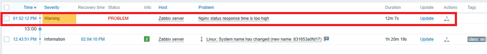


<p><sub>응답시간 초과 알림 메일 수신</sub></p>

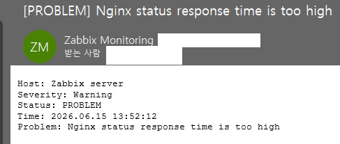

</details>

복구:

```bash
cp nginx/conf.d/default.conf.bak nginx/conf.d/default.conf
docker exec nginx-sample nginx -s reload
```

복구 후 기대 결과:

* `/status` 응답시간이 정상 범위로 돌아온다.
* Trigger가 `RESOLVED` 상태로 전환된다.
* 복구 알림 메일이 수신된다.

<details>
<summary><strong>복구 스크린샷 보기</strong></summary>


<p><sub>응답시간 초과 Trigger RESOLVED 전환</sub></p>

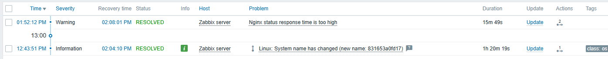


<p><sub>응답시간 초과 복구 알림 메일 수신</sub></p>

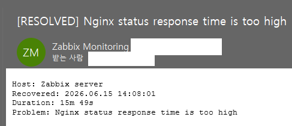

</details>

### 7.3 응답 코드 비정상 테스트

`/health` 응답 코드가 `200`이 아니도록 nginx 설정을 임시로 변경한다. 테스트 전 원본 설정을 백업한다.

```bash
cp nginx/conf.d/default.conf nginx/conf.d/default.conf.bak
```

`nginx/conf.d/default.conf`의 `/health` location을 다음과 같이 테스트용으로 변경한다.

```nginx
location /health {
    auth_basic "Zabbix sample";
    auth_basic_user_file /etc/nginx/.htpasswd;
    default_type text/plain;
    return 500 "health error\n";
}
```

변경한 설정을 nginx에 반영한다.

```bash
docker exec nginx-sample nginx -s reload
```

기대 결과:

* Web Scenario의 `health` Step에서 HTTP 응답 코드 `500`이 수집된다.
* `Nginx web scenario failed` Trigger가 `PROBLEM` 상태로 전환된다.
* `Nginx endpoint response code is not 200` Trigger가 `PROBLEM` 상태로 전환된다.
* 각 Trigger에 대한 High 알림 메일이 수신된다.

<details>
<summary><strong>장애 발생 스크린샷 보기</strong></summary>


<p><sub>응답 코드 비정상 Trigger PROBLEM 전환</sub></p>

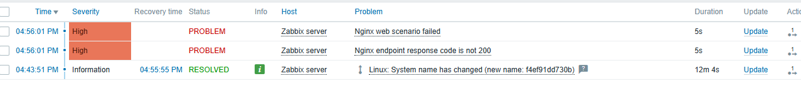


<p><sub>Web Scenario 실패 알림 메일 수신</sub></p>

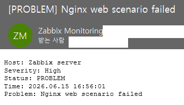


<p><sub>응답 코드 비정상 알림 메일 수신</sub></p>

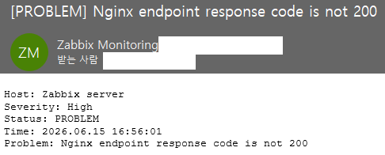

</details>

복구:

```bash
cp nginx/conf.d/default.conf.bak nginx/conf.d/default.conf
docker exec nginx-sample nginx -s reload
```

복구 후 기대 결과:

* `/health` 응답 코드가 다시 `200`으로 돌아온다.
* Trigger가 `RESOLVED` 상태로 전환된다.
* 복구 알림 메일이 수신된다.

<details>
<summary><strong>복구 스크린샷 보기</strong></summary>


<p><sub>응답 코드 비정상 Trigger RESOLVED 전환</sub></p>

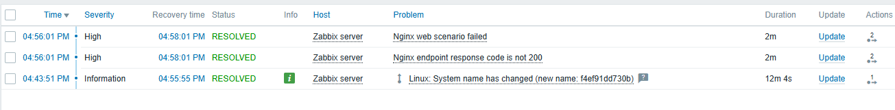


<p><sub>Web Scenario 복구 알림 메일 수신</sub></p>

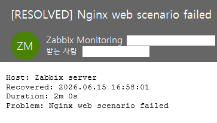


<p><sub>응답 코드 비정상 복구 알림 메일 수신</sub></p>

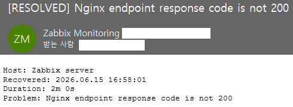

</details>

</details>

<details>
<summary><strong>8. nginx 내부 지표 테스트 방법</strong></summary>

## 8. nginx 내부 지표 테스트 방법

nginx 내부 지표 테스트는 Agent 2가 수집한 값에 따라 Trigger와 Email Action이 정상 동작하는지 확인하는 절차이다.

### 8.1 nginx active connections 증가 테스트

active connection 부하는 `scripts/nginx_load_test.sh`의 `active` 모드로 발생시킨다.
`nginx/conf.d/default.conf`에는 테스트용 `/load-slow` endpoint가 포함되어 있으며, 이 endpoint는 응답을 천천히 내려보내 Zabbix 수집 주기 동안 connection이 유지되도록 한다.

현재 nginx 내부 지표 Item은 `30s` 주기로 수집된다.
따라서 Warning Trigger인 `min(1m)>50`을 검증하려면 active connection 50 초과 상태가 최소 1분 이상 유지되어야 한다.

먼저 기준값을 확인한다.

```bash
sh scripts/nginx_load_test.sh status
```

Warning Trigger 검증을 위해 60개 동시 연결을 90초 동안 유지한다.

```bash
COUNT=60 DURATION=90 sh scripts/nginx_load_test.sh active
```

기대 결과:

* Zabbix Latest data 또는 Graph에서 `nginx active connections` 값이 50을 초과한다.
* `nginx active connections is high` Trigger가 `PROBLEM` 상태로 전환된다.
* Warning 알림 메일이 수신된다.

High Trigger 검증을 위해 110개 동시 연결을 90초 동안 유지한다.

```bash
COUNT=110 DURATION=90 sh scripts/nginx_load_test.sh active
```

기대 결과:

* Zabbix Latest data 또는 Graph에서 `nginx active connections` 값이 100을 초과한다.
* `nginx active connections is critically high` Trigger가 `PROBLEM` 상태로 전환된다.
* High 알림 메일이 수신된다.

<details>
<summary><strong>장애 발생 스크린샷 보기</strong></summary>

<p><sub>active connections Trigger PROBLEM 전환</sub></p>

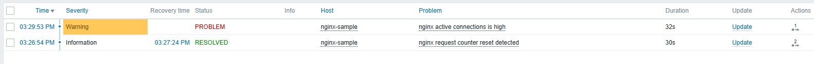

<p><sub>active connections 알림 메일 수신</sub></p>

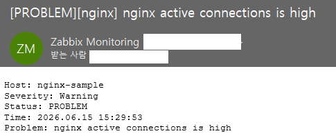

</details>

복구:

테스트 스크립트는 `DURATION` 시간이 지나면 부하 요청을 종료한다.
이후 active connections 값이 정상 범위로 감소하고 Trigger가 `RESOLVED` 상태로 전환되는지 확인한다.

복구 후 기대 결과:

* active connections 값이 정상 범위로 감소한다.
* Trigger가 `RESOLVED` 상태로 전환된다.
* 복구 알림 메일이 수신된다.

<details>
<summary><strong>복구 스크린샷 보기</strong></summary>

<p><sub>active connections Trigger RESOLVED 전환</sub></p>

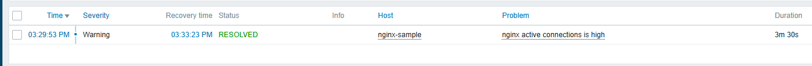

<p><sub>active connections 복구 알림 메일 수신</sub></p>

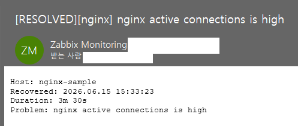

</details>

### 8.2 nginx request counter reset 테스트

먼저 nginx request counter가 증가하도록 여러 번 요청을 발생시킨다.

```bash
COUNT=30 CONCURRENCY=10 TARGET_PATH=/status sh scripts/nginx_load_test.sh requests
```

`Monitoring` > `Latest data`에서 `nginx total requests` 값이 증가한 것을 확인한 뒤 nginx 컨테이너를 재시작한다.

```bash
docker restart nginx-sample
```

기대 결과:

* nginx `stub_status`의 누적 request counter가 초기화된다.
* 이전 수집값보다 최신 수집값이 작아진다.
* `nginx request counter reset detected` Trigger가 `PROBLEM` 상태로 전환된다.
* Information 알림 메일이 수신된다.

<details>
<summary><strong>장애 발생 스크린샷 보기</strong></summary>


<p><sub>request counter reset Trigger PROBLEM 전환</sub></p>

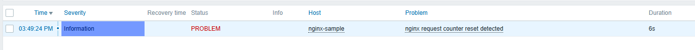


<p><sub>request counter reset 알림 메일 수신</sub></p>

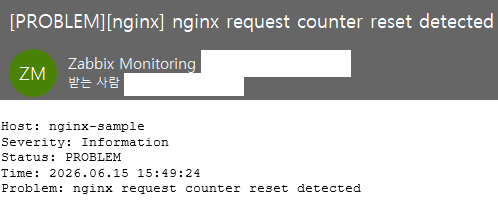

</details>

복구:

nginx 컨테이너가 정상 실행 중인지 확인하고, request counter가 다시 증가하는지 확인한다.

```bash
docker compose ps nginx
COUNT=1 CONCURRENCY=1 TARGET_PATH=/status sh scripts/nginx_load_test.sh requests
```

복구 후 기대 결과:

* nginx가 정상 실행된다.
* Trigger가 `RESOLVED` 상태로 전환된다.
* 복구 알림 메일이 수신된다.

<details>
<summary><strong>복구 스크린샷 보기</strong></summary>


<p><sub>request counter reset Trigger RESOLVED 전환</sub></p>

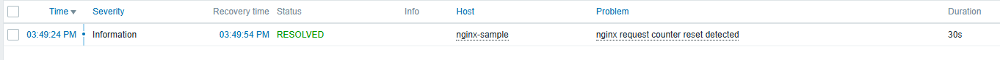


<p><sub>request counter reset 복구 알림 메일 수신</sub></p>

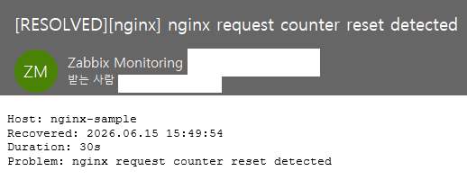

</details>

### 8.3 nginx 부하 테스트 반복 실험

nginx 관련 Item의 적정 수집 주기와 Trigger 반응성을 확인하려면 짧은 요청 증가 테스트와 active connection 유지 테스트를 분리해서 수행한다.<br>
기본적으로 nginx 내부 지표 Item은 `30s` 주기로 수집되므로, active connection 부하는 최소 `90s` 이상 유지해야 Zabbix 수집 시점에 안정적으로 관측된다.

현재 값을 먼저 확인한다.

```bash
sh scripts/nginx_load_test.sh status
```

다음과 같이 짧은 요청 부하는 `nginx total requests` 증가 여부와 Web Scenario 응답시간 변화를 확인하는 용도로 사용한다.

```bash
COUNT=300 CONCURRENCY=20 TARGET_PATH=/status sh scripts/nginx_load_test.sh requests
```

active connection 부하는 `nginx active connections is high`와 `nginx active connections is critically high` Trigger의 기준값과 수집 주기가 적절한지 확인하는 용도로 사용한다.
이때, `COUNT`는 동시 요청 수, `DURATION`은 연결을 유지할 시간이다.

```bash
COUNT=60 DURATION=90 sh scripts/nginx_load_test.sh active
```

반복 실험은 다음 순서로 진행한다.

| 실험 | 명령 예시 | 확인 항목 |
| --- | --- | --- |
| 기준값 확인 | `sh scripts/nginx_load_test.sh status` | active connections, total requests, process count |
| 요청량 증가 | `COUNT=300 CONCURRENCY=20 TARGET_PATH=/status sh scripts/nginx_load_test.sh requests` | total requests 증가, Web Scenario 응답시간 |
| 동시접속 30개 | `COUNT=30 DURATION=90 sh scripts/nginx_load_test.sh active` | Trigger 미발생 여부 |
| 동시접속 45개 | `COUNT=45 DURATION=90 sh scripts/nginx_load_test.sh active` | 경계 구간 안정성 |
| 동시접속 60개 | `COUNT=60 DURATION=90 sh scripts/nginx_load_test.sh active` | `nginx active connections is high` Warning 발생 여부 |
| 동시접속 110개 | `COUNT=110 DURATION=90 sh scripts/nginx_load_test.sh active` | `nginx active connections is critically high` High 발생 여부 |

효율적인 운영 기준을 파악할 때, 다음과 같은 예시를 참고한다.
* `30s` 수집 주기에서는 부하를 최소 `90s` 유지해야 누락 가능성이 낮다.
* 지속적인 과부하는 `min(1m)>50` 조건으로 Warning 알림을 발생시켜 일시적인 피크와 구분한다.
* 급격한 과부하는 `last()>100` 조건으로 High 알림을 발생시킨다.
* 오탐을 줄이고 싶으면 Web Scenario `Attempts`를 `2`로 올리고, 장애 감지 시간이 약 1회 주기만큼 늦어지는지 확인한다.

</details>

<details>
<summary><strong>9. Browser Item 기반 Midibus E2E 모니터링</strong></summary>

## 9. Browser Item 기반 Midibus E2E 모니터링

Midibus는 Zabbix Agent 기반으로 직접 운영 상태를 수집하는 대상이 아니라, 외부 서비스 대상이다.<br>
따라서 `midibus-web` Host는 Agent interface 없이 Browser Item, Dependent Item, Trigger를 구성하는 논리 Host로 사용한다.<br>
Zabbix Server의 Browser poller가 Selenium WebDriver로 접속하도록 설정되었으며, 이때 Selenium Chrome 컨테이너는 Browser Item에서 실제 브라우저 실행을 담당한다.


### 9.1 Browser Item 구성

Midibus 주요 기능 검증을 5개 Browser Item으로 분리하여 구성한다.
각 Browser Item은 로그인부터 시작하여 독립적으로 실행되도록 구성한다.

| Step | Item name | Key | 검증 내용 |
| --- | --- | --- | --- |
| 1 | `Midibus login check` | `midibus_browser_login` | 로그인, 팝업 닫기, 대시보드 확인 |
| 2 | `Midibus category and channel config check` | `midibus_browser_category_channel` | 카테고리 생성/삭제, VOD 채널 배포 설정 저장 |
| 3 | `Midibus media upload delete check` | `midibus_browser_media_crud` | 미디어 업로드, 목록 확인, 삭제 확인 |
| 4 | `Midibus browser secure playback` | `midibus_browser_secure_playback` | 보안 재생키 생성, 배포 URL 적용, 영상 재생 |
| 5 | `Midibus browser sub user check` | `midibus_browser_sub_user_lifecycle` | 보조 사용자 추가, 권한 변경, 삭제 확인 |

<details>
<summary><strong>Browser Item substep 상세 목록 보기</strong></summary>

#### Step 1. 로그인 확인

1. Midibus 로그인 페이지 접속
2. ID, PW 입력
3. 로그인 버튼 클릭
4. 로그인 직후 표시되는 튜토리얼/안내 팝업 닫기
5. 대시보드 메뉴 또는 로그인 후 화면 요소 확인
6. `dashboard usable` performance mark 기록

#### Step 2. 카테고리 생성 및 채널 배포 설정

1. Midibus 로그인
2. 튜토리얼/안내 팝업 닫기
3. 미디어 메뉴 열기
4. 카테고리 추가 버튼 클릭
5. 카테고리명 입력
6. 카테고리 추가 버튼 클릭
7. 설정 메뉴로 이동
8. 카테고리 탭 선택
9. 생성한 카테고리 선택
10. 카테고리 삭제 버튼 클릭
11. 브라우저 alert 확인
12. 삭제 후 카테고리가 목록에서 제거되었는지 확인
13. VOD 채널 탭 선택
14. 채널 URL 사용 여부 체크박스 변경
15. 저장 버튼 클릭
16. `save channel config` performance mark 기록

#### Step 3. 미디어 업로드, 확인, 삭제

1. Midibus 로그인
2. 튜토리얼/안내 팝업 닫기
3. 미디어 업로드 버튼 클릭
4. Selenium 컨테이너 내부 테스트 영상 파일 선택
5. 업로드 시작 버튼 클릭
6. 업로드 처리 대기
7. 업로드 창 닫기
8. 미디어 메뉴의 전체 목록으로 이동
9. 업로드한 미디어 이름 확인
10. 해당 미디어 체크박스 선택
11. 작업 선택에서 삭제 선택
12. 브라우저 alert 확인
13. 삭제 후 목록에서 미디어가 제거되었는지 확인
14. `delete media` performance mark 기록

#### Step 4. 보안 재생키 생성 및 영상 재생

1. Midibus 로그인
2. 튜토리얼/안내 팝업 닫기
3. 배포 메뉴 열기
4. 재생 제한 채널로 이동
5. 테스트 영상 이름 클릭
6. 보안 재생 키 생성 버튼 클릭
7. 유효 시간을 1일로 설정
8. 허용 IP 입력
9. 재생 키 생성 버튼 클릭
10. 배포 URL에 적용
11. 보안 재생키 생성 창 닫기
12. 배포 URL을 새 브라우저 페이지로 열기
13. Player 재생 버튼 클릭
14. `play secure video` performance mark 기록

#### Step 5. 보조 사용자 추가, 권한 변경, 삭제

1. Midibus 로그인
2. 튜토리얼/안내 팝업 닫기
3. 프로필 메뉴 열기
4. 보조 사용자 화면으로 이동
5. 보조 사용자 추가 버튼 클릭
6. 계정 등급을 마스터로 선택
7. 테스트 이메일, 비밀번호, 이름, 연락처 입력
8. 저장 버튼 클릭
9. 저장 후 목록 갱신 대기
10. 생성된 보조 사용자 이름 클릭
11. 계정 등급을 사용자로 변경
12. 저장 버튼 클릭
13. 저장 후 목록 갱신 대기
14. 삭제 버튼 클릭
15. 브라우저 alert 확인
16. 삭제 후 목록에서 보조 사용자가 제거되었는지 확인
17. `delete sub user` performance mark 기록

</details>

<details>
<summary><strong>Browser Item 설정 화면 보기</strong></summary>

<p><sub>Step 1. 로그인 확인 Browser Item 설정</sub></p>

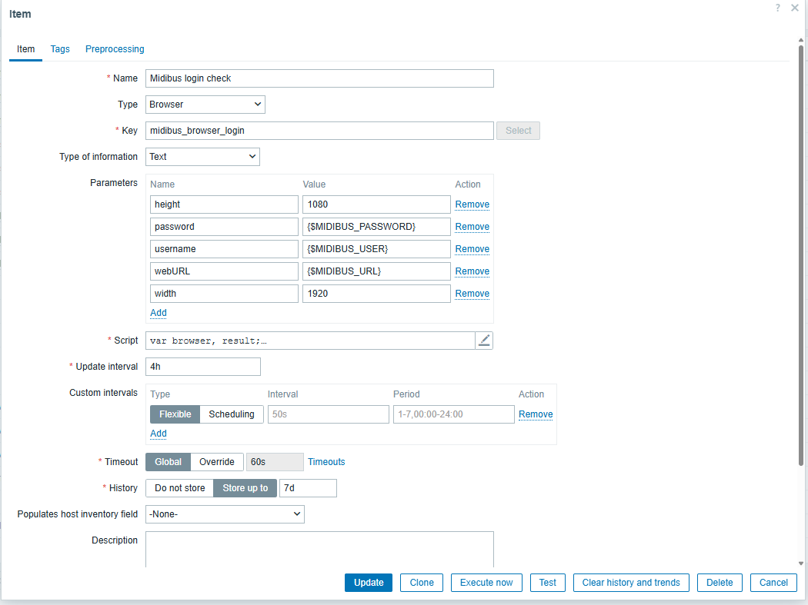

<p><sub>Step 2. 카테고리 생성/삭제 및 채널 배포 설정 Browser Item 설정</sub></p>

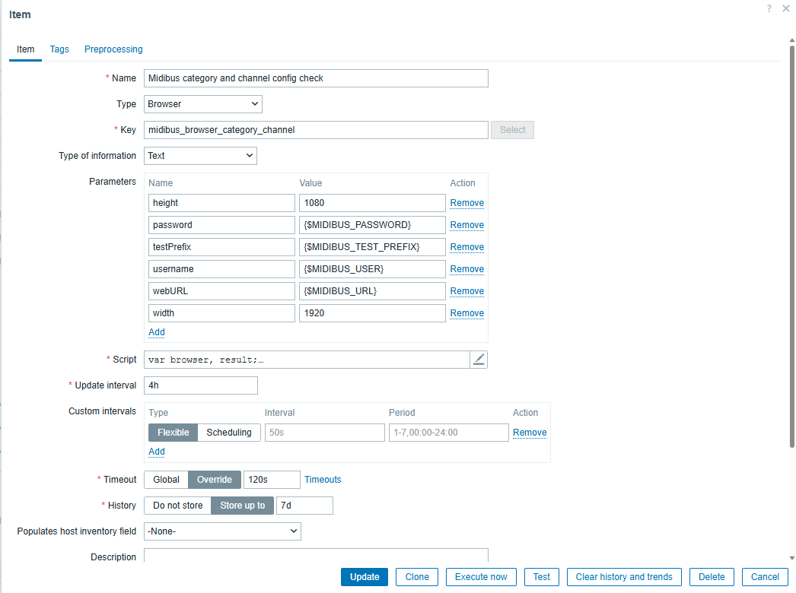

<p><sub>Step 3. 미디어 업로드/삭제 Browser Item 설정</sub></p>

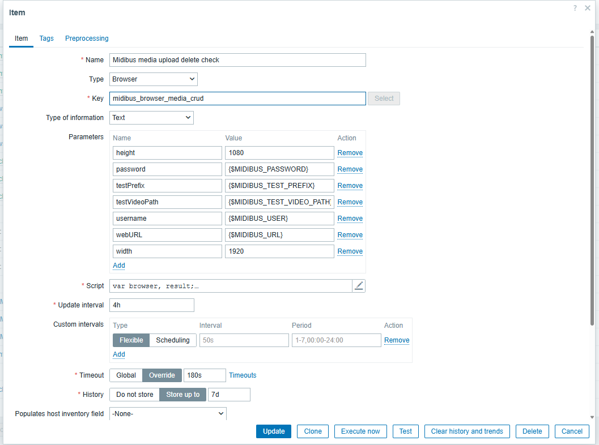

<p><sub>Step 4. 보안 재생키 생성 및 영상 재생 Browser Item 설정</sub></p>

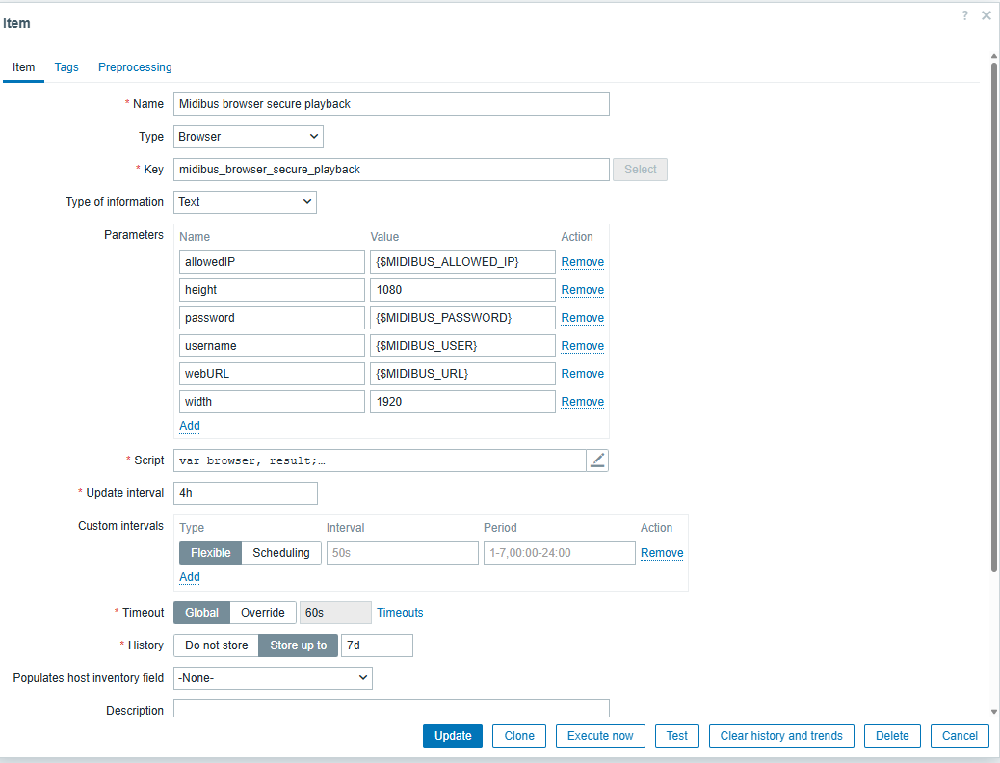

<p><sub>Step 5. 보조 사용자 관리 Browser Item 설정</sub></p>

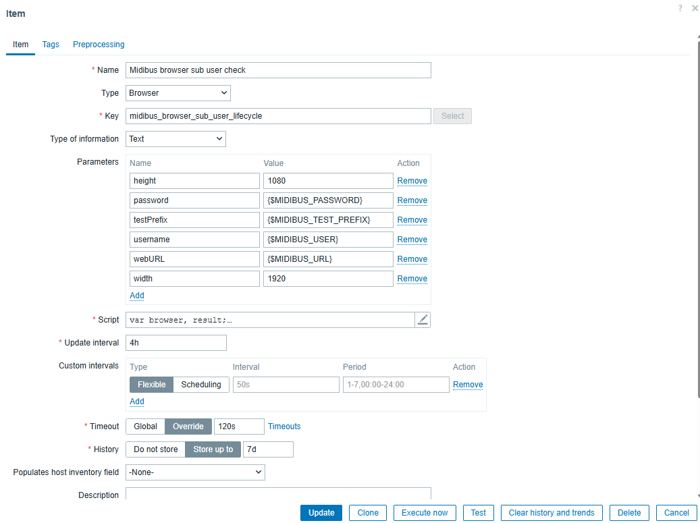

</details>

각 Browser Item의 script는 `zabbix/browser-items/` 디렉터리에 보관한다.
각 Browser Item의 Type of information은 JSON 결과를 저장하기 위해 `Text`로 설정한다.
실행 결과는 Browser Item 원본 값에 JSON 형태로 저장되며, Trigger 판단에는 Dependent Item을 사용한다.

### 9.2 Browser Item 실행 결과 검증 구조

Browser Item은 실행 결과를 Text JSON으로 반환하므로, Trigger에서 바로 성공/실패를 판단하기 어렵다.
따라서 원본 Browser Item마다 Dependent Item을 생성하여 실행 상태와 기능 검증 상태를 숫자값으로 변환한다.

| Dependent Item 종류 | Type of information | 용도 |
| --- | --- | --- |
| `execution.status` | Numeric unsigned | Browser Item 실행 자체가 실패했는지 판단 |
| `execution.message` | Text | 실행 실패 시 오류 메시지 표시 |
| `validation.status` | Numeric unsigned | 기대한 기능 검증 mark가 기록되었는지 판단 |

- `execution.status`는 Browser Item 결과 JSON에 `error.message`가 있으면 `0`, 없으면 `1`을 반환한다.
- `execution.message`는 실패 시 시나리오 이름과 오류 메시지를 반환하고, 정상일 때는 빈 문자열을 반환한다.
- `validation.status`는 Browser Item 결과 JSON의 performance mark에 기대한 최종 성공 mark가 있는지 확인한다.

각 시나리오의 최종 성공 mark는 Browser Item Step 성공적으로 완료되었음을 의미하며, 시나리오별 performance mark(= validation expected mark)는 다음과 같다.

| 시나리오 | validation expected mark |
| --- | --- |
| 로그인 | `dashboard usable` |
| 카테고리/채널 설정 | `save channel config` |
| 미디어 업로드/삭제 | `delete media` |
| 보안 재생키 재생 | `play secure video` |
| 보조 사용자 관리 | `delete sub user` |

<p><sub>Browser Item 및 Dependent Item 정상 실행 결과</sub></p>

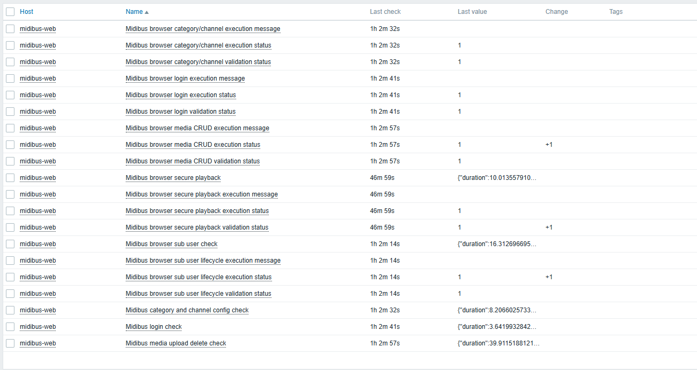

### 9.3 Browser Item Trigger 구성

Browser Item 관련 Trigger는 2개로 구성한다.

| Trigger name | Severity | 목적 |
| --- | --- | --- |
| `Browser Item execution failed` | High | Browser Item 스크립트 실행 실패 감지 |
| `Midibus feature validation failed` | High | 로그인 또는 주요 기능 검증 실패 감지 |

- `Browser Item execution failed` Trigger는 5개 `execution.status` Dependent Item 중 하나라도 `0`이면 발생한다. <br>
- `Midibus feature validation failed` Trigger는 5개 `validation.status` Dependent Item 중 하나라도 `0`이면 발생한다.


### 9.4 Browser Item Email 알림

Browser Item 관련 알림은 Email Media type과 사용자 Media 설정을 사용한다.<br>
Trigger별 메시지 제목은 실행 실패와 기능 검증 실패가 구분되도록 다음과 같이 구성한다.

Browser Item 실행 실패 알림 제목:

```text
[PROBLEM][Midibus Browser Execution] {HOST.NAME} - {TRIGGER.NAME}
[RESOLVED][Midibus Browser Execution] {HOST.NAME} - {TRIGGER.NAME}
```

Midibus 기능 검증 실패 알림 제목:

```text
[PROBLEM][Midibus Feature Validation] {HOST.NAME} - {TRIGGER.NAME}
[RESOLVED][Midibus Feature Validation] {HOST.NAME} - {TRIGGER.NAME}
```

알림 본문에는 `{EVENT.OPDATA}`를 포함하여 Trigger의 Operational data에 기록된 실행 실패 메시지를 함께 확인한다.

```text
Host: {HOST.NAME}
Time: {EVENT.DATE} {EVENT.TIME}
Severity: {TRIGGER.SEVERITY}
Problem: {TRIGGER.NAME}

Details:
{EVENT.OPDATA}

Event ID: {EVENT.ID}
```

</details>

<details>
<summary><strong>10. Browser Item 장애 테스트 방법</strong></summary>

## 10. Browser Item 장애 테스트 방법

### 10.1 Browser Item 실행 실패 테스트

`Browser Item execution failed` Trigger는 Browser Item 실행 결과에 오류가 발생했을 때 동작하는지 확인한다.
테스트는 `{$MIDIBUS_PASSWORD}` Host macro 값을 임시로 잘못된 값으로 변경하여 로그인 실패를 유도하는 방식으로 수행한다.

테스트 절차:

1. `midibus-web` Host macro에서 `{$MIDIBUS_PASSWORD}` 값을 임시로 오입력한다.
2. Browser Item을 실행하여 로그인 실패를 발생시킨다.
3. `execution.status` 값이 `0`으로 변경되는지 확인한다.
4. `execution.message`에 실패한 시나리오와 오류 메시지가 기록되는지 확인한다.
5. `Browser Item execution failed` Trigger가 `PROBLEM` 상태로 전환되고 Email 알림이 수신되는지 확인한다.
6. `{$MIDIBUS_PASSWORD}` 값을 원래 값으로 복구한 뒤 Browser Item을 다시 실행한다.
7. Trigger가 `RESOLVED` 상태로 전환되고 복구 Email 알림이 수신되는지 확인한다.

기대 결과:

* 실행 실패 시 `execution.status`는 `0`이 된다.
* 실행 실패 원인은 `execution.message`에서 확인할 수 있다.
* 실행 실패 상황에서는 `Browser Item execution failed` Trigger만 장애로 판단한다.
* 복구 후 `execution.status`가 `1`로 돌아오고 Trigger가 `RESOLVED` 상태가 된다.

<details>
<summary><strong>실행 실패 테스트 스크린샷 보기</strong></summary>


<p><sub>장애 발생 전 Browser Item 정상 상태</sub></p>

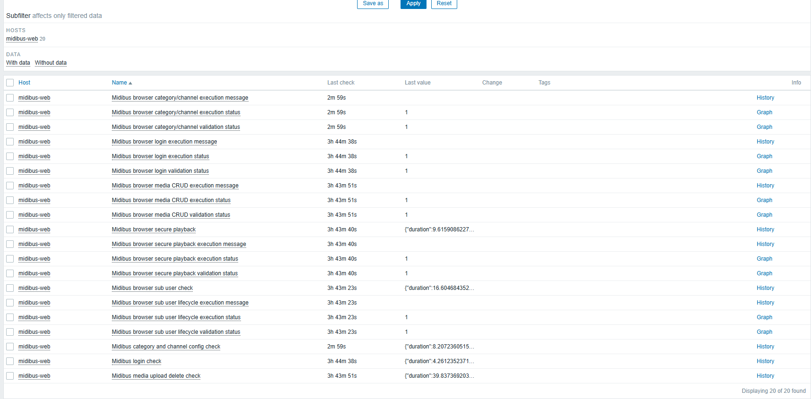


<p><sub>로그인 실패 후 execution.status 0 확인</sub></p>

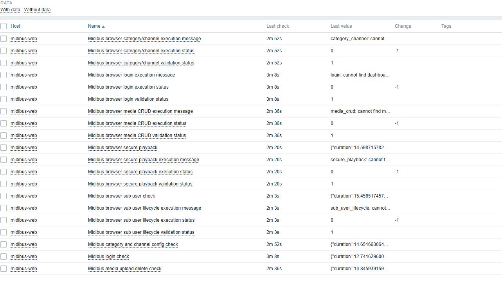


<p><sub>Browser Item 실행 실패 Trigger PROBLEM 전환</sub></p>

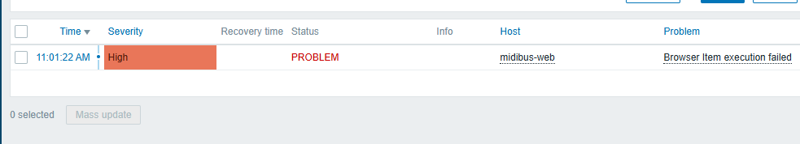


<p><sub>Browser Item 실행 실패 알림 메일 수신</sub></p>

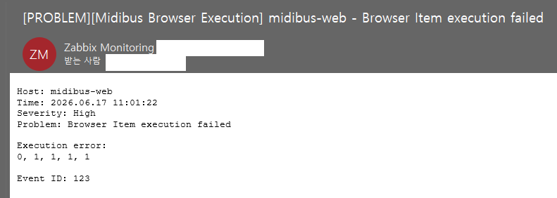


<p><sub>매크로 원복 후 Browser Item 정상 상태</sub></p>

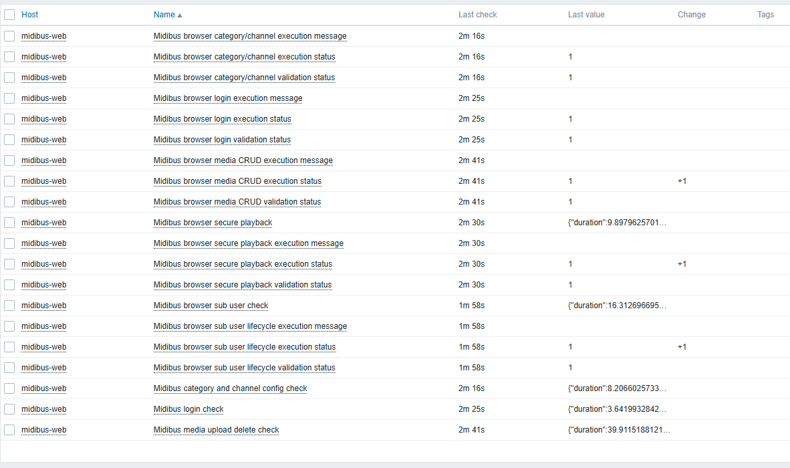


<p><sub>Browser Item 실행 실패 Trigger RESOLVED 전환</sub></p>

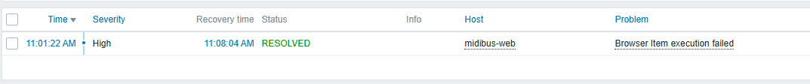


<p><sub>Browser Item 실행 실패 복구 알림 메일 수신</sub></p>

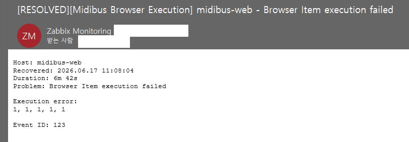

</details>

### 10.2 Midibus 기능 검증 실패 테스트

`Midibus feature validation failed` Trigger는 Browser Item 스크립트 실행은 성공했지만 validation expected mark(= performance mark)가 없을 때 동작해야 한다. 이를 확인하기 위해, "Step 4: 보안 재생키 생성 및 영상 재생" 시나리오의 validation expected mark를 임시로 `play secure video`에서 `intentional failure test`로 변경한 후 Browser Item을 실행한다.

테스트 절차:

1. `midibus.browser.secure_playback.validation.status` Dependent Item의 preprocessing script에서 expected mark를 임시 변경한다.
2. 기존 값 `play secure video`를 `intentional failure test`로 변경한다.
3. `midibus_browser_secure_playback` Browser Item을 실행한다.
4. Browser Item 실행 자체는 성공하여 `execution.status`가 `1`인지 확인한다.
5. 기대한 validation mark를 찾지 못해 `validation.status`가 `0`으로 변경되는지 확인한다.
6. `Midibus feature validation failed` Trigger가 `PROBLEM` 상태로 전환되고 Email 알림이 수신되는지 확인한다.
7. expected mark를 `play secure video`로 원복한 뒤 Browser Item을 다시 실행한다.
8. `validation.status`가 `1`로 돌아오고 Trigger가 `RESOLVED` 상태로 전환되는지 확인한다.

기대 결과:

* 스크립트 실행 자체는 성공하므로 `execution.status`는 `1`을 유지한다.
* 기능 검증 mark가 없으므로 `validation.status`는 `0`이 된다.
* 기능 검증 실패 상황에서는 `Midibus feature validation failed` Trigger가 장애로 판단한다.
* expected mark를 원복하고 재실행하면 Trigger가 `RESOLVED` 상태가 된다.

<details>
<summary><strong>기능 검증 실패 테스트 스크린샷 보기</strong></summary>


<p><sub>validation expected mark 임시 변경</sub></p>

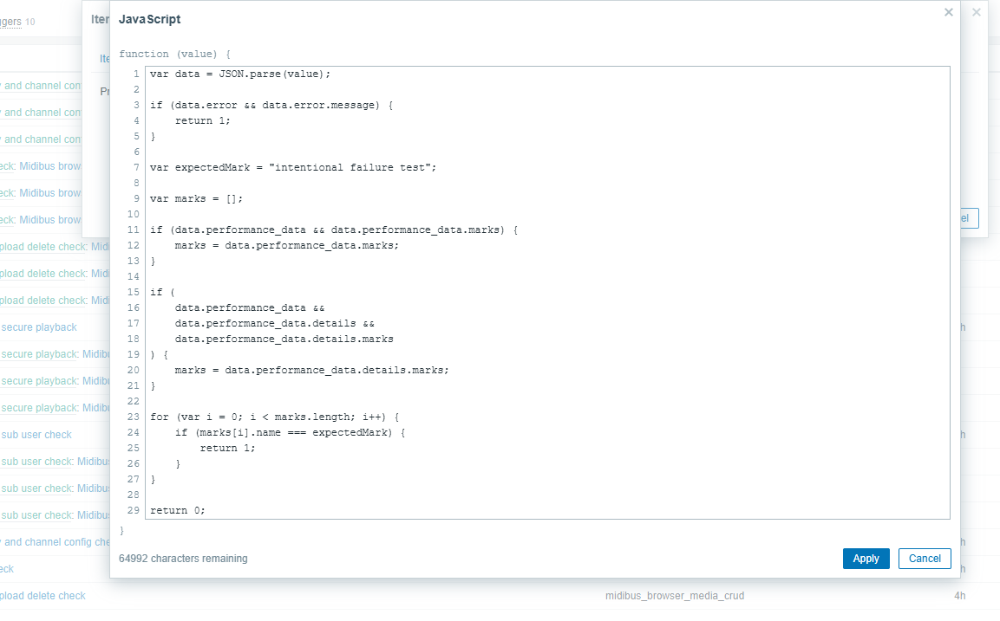


<p><sub>기능 검증 실패 중 validation.status 0 확인</sub></p>

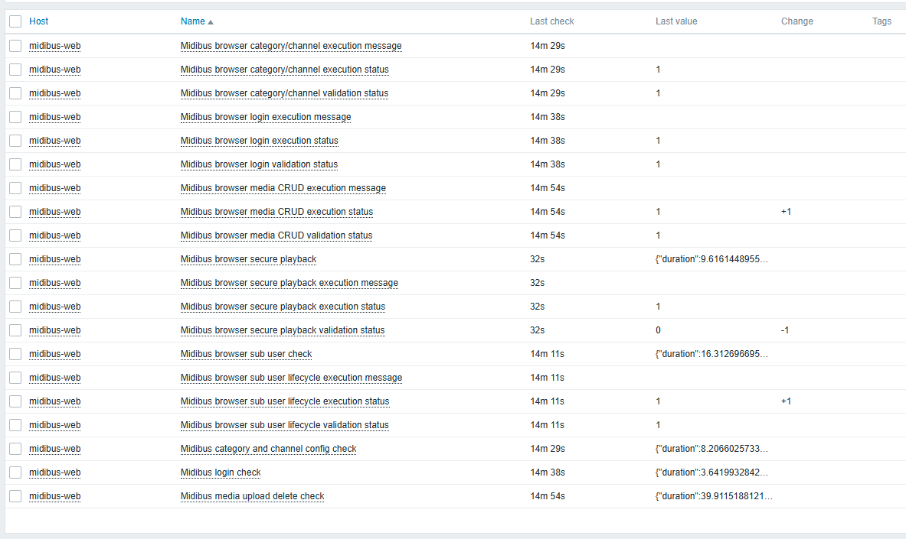


<p><sub>Midibus 기능 검증 실패 Trigger PROBLEM 전환</sub></p>

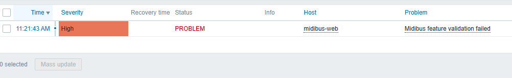


<p><sub>Midibus 기능 검증 실패 알림 메일 수신</sub></p>

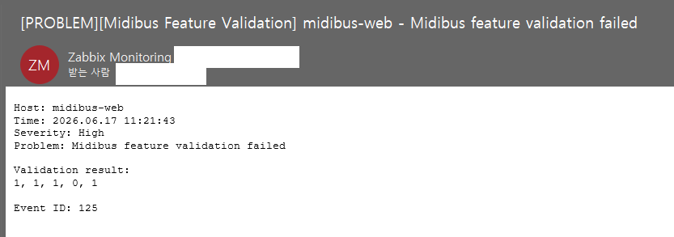


<p><sub>expected mark 원복 후 validation.status 1 확인</sub></p>

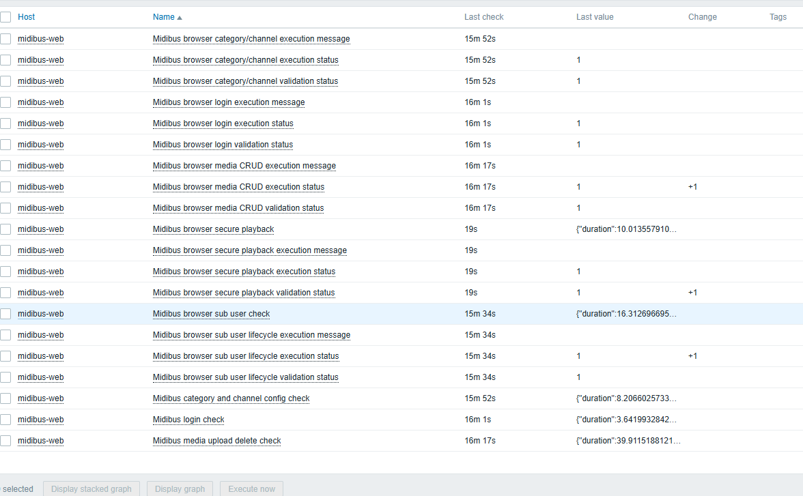


<p><sub>Midibus 기능 검증 실패 Trigger RESOLVED 전환</sub></p>

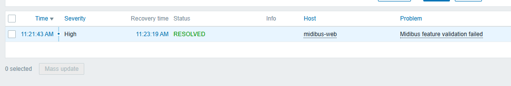


<p><sub>Midibus 기능 검증 실패 복구 알림 메일 수신</sub></p>

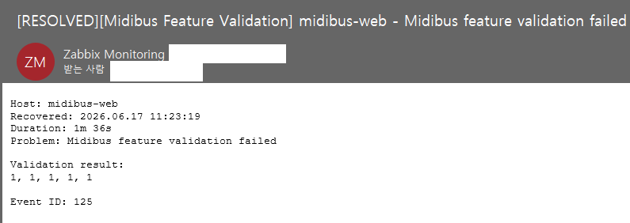

</details>


</details>

<details>
<summary><strong>11. 트러블슈팅</strong></summary>

## 11. 트러블슈팅
### 11.1 Zabbix Agent2 Not Available

* 증상: Zabbix UI에서 `Zabbix agent is not available` 문제 발생
* 원인: Zabbix Host의 Agent Interface가 Docker 내부 Agent2 컨테이너 주소와 일치하지 않음
* 해결:

  * `docker-compose.yml`에서 `ZBX_HOSTNAME`을 `Zabbix server`로 설정
  * Zabbix UI에서 `Zabbix server` Host의 Agent Interface를 DNS `zabbix-agent2`, Port `10050`으로 수정

### 11.2 Action Log: No media defined for user

* 증상:

  * `Monitoring` > `Problems`에는 Trigger가 정상적으로 `PROBLEM` 상태로 표시됨
  * `Reports` > `Action log`에는 메일 발송 실패 기록이 남음
  * Info에 다음 오류가 표시됨

```text
No media defined for user
```

* 원인:

  * Email Media type은 설정되어 있지만, 실제 수신자인 `Admin` 사용자에게 Media가 등록되어 있지 않음
  * Trigger Action은 사용자에게 메시지를 보내려고 했지만, 해당 사용자의 수신 이메일 정보를 찾지 못함

* 해결:

  * `Users` > `Users` > `Admin` > `Media`에서 Email Media를 추가
  * 수신 이메일 주소, 활성 시간, Severity 조건을 설정
  * Action을 저장한 뒤 기존 Problem이 아니라 새로운 Problem 이벤트를 발생시켜 다시 테스트

### 11.3 Browser Item 한글 텍스트 Selector 실패

* 증상:

  * Browser Item Test 결과 JSON을 확인했을 때 특정 단계까지는 정상 진행되지만, 이후 버튼 클릭 단계에서 스크립트가 중단됨
  * 화면에는 버튼이 존재하지만 Browser Item에서는 해당 버튼을 찾지 못하거나 클릭하지 못하는 오류가 발생함
  * 특히 `추가`, `저장`, `삭제`, `재생`처럼 한글 UI 텍스트를 기준으로 찾는 selector에서 문제가 발생할 수 있었음

* 원인:

  * Browser Item JavaScript를 Zabbix UI에 입력하거나 파일로 정리하는 과정에서 한글 문자열이 깨지거나 다르게 전달될 수 있음
  * 한글 버튼 텍스트 기반 XPath는 인코딩, 공백, 렌더링 상태에 민감하여 안정성이 낮음

* 해결:

  * 한글 UI 텍스트 기반 selector 사용을 줄이고, 가능한 경우 `id`, `onclick`, `type`, `data-bs-target` 기반 selector로 변경
  * 결과 JSON의 performance mark를 확인하여 어느 단계까지 실행되었는지 추적하고, 중단 지점의 selector를 우선 수정
  * 최종적으로 각 Browser Item은 마지막 성공 mark가 기록되는지 확인하여 시나리오 전체가 끝까지 수행되는지 검증

</details>
